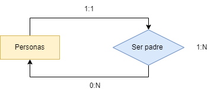
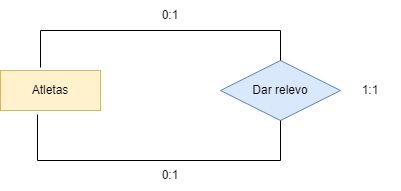
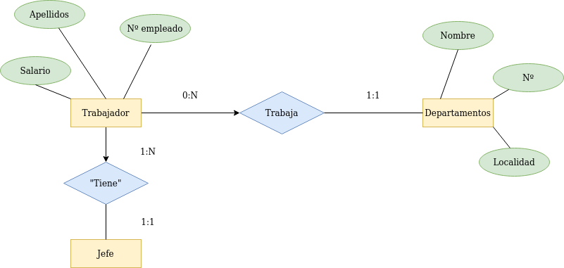
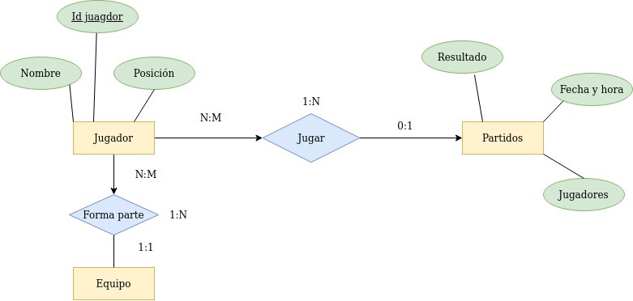
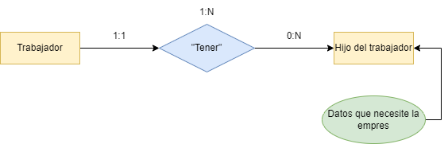
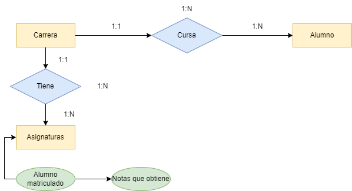

# DIAGRAMAS ENTIDAD-RELACIÓN

- **Nº 1:** En una academia los profesores dan clase a los alumnos matriculados de modo que todo profesor da clase al menos a un alumno y todo alumno recibe clase de un único profesor.

    

- **Nº2:** Los profesores de un centro pueden ser o no tutores de un alumno, en cualquier caso los alumnos solo podrán tener un único tutor.
          
    

- **Nº3:** En un comercio, un cliente compra varios productos, y un producto puede ser comprado por varios clientes.

    

- **Nº4:** Representa la relación entre Personas y sus padres.

    

- **Nº5:** En una carrera de relevos, representar la relación dar el relevo entre atletas(para calcular las cardinalidades máxima y mínima deberás tener en cuenta si se trata de el primero, el último o el 2º o 3º)

    

- **Nº6:**: Una empresa está compuesta por varios departamentos de los que se desea almacenar su nº, nombre y localidad. - Los empleados deben estar asignados a un departamento y se guardarán sus datos nºempleado, apellido, salario. Además, cada empleado tiene un jefe.

    

- **Nº7:** Se desea construir una bd para mantener información sobre los equipos y partidos de la liga. - Un equipo tiene un cierto nº de jugadores (Id_jugador, datos personales) y no todos participan en cada partido. Queremos registrar además por cada partido, qué jugadores juegan, la fecha y la hora del partido, resultados de los encuentros y las posiciones donde juegan.

    

- **Nº8:** En una empresa, para cada uno de sus empleados, se guardan los datos de sus hijos. Representa esta relación haciendo las suposiciones que creas convenientes.

    

- **Nº9:** Se desea diseñar una BD para una Universidad que contenga información sobre carreras y asignaturas que se pueden estudiar. Además se incluirá la información de los alumnos matriculados en las correspondientes asignaturas y las calificaciones que obtienen en las asignaturas en las que están matriculados. Nota: suponer que una asignatura solo puede pertenecer a una carrera.

    

