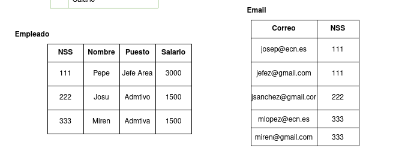
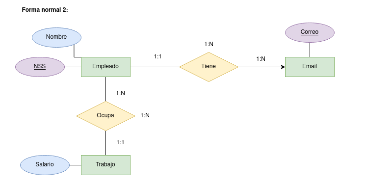
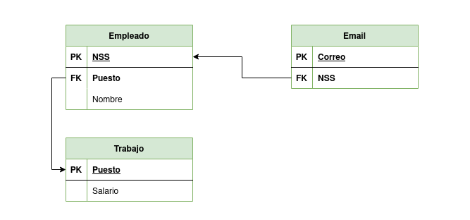
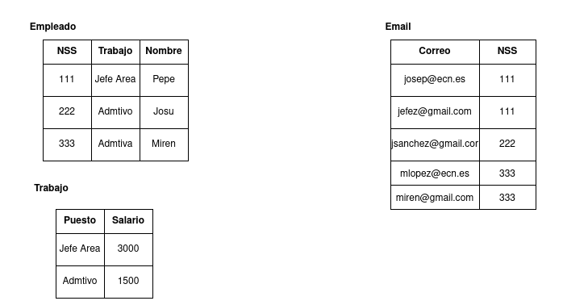

# INFORME SOBRE EJERCICIO 3 NORMAÑIZACIÓN

1. ***Indicar las claves candidatas:***
- En un principio las claves que parecen candidatas son el número de la seguridad social y quizá el email en una nueva tabla puesto que es multivaluada. Además, Puesto también podría llegar a ser clave primaria en caso de una nueva tabla

2. ***Normalizar en 1º forma:***
Según la tabla que se nos indica, partimos de una sola tabla/entidad que seŕia:   

Partiendo de esta, debemos eliminar los atributos multivaluados generando una nueva tabla. De esta forma, los diagramas ER y MR se transformarian en:   

Y, una vez hayamos "vuelto hacia atrás" y hayamos constuido los diagramas ER y MR, escribimos las nuevas tablas de **Empleado** y **Email**:   

3. ***Normalizar en 2º forma:***  
Con la 1º forma ya hecha, pasamos a hacer la segunda. En este paso, trataremos de eliminar los atributos que no se relacionen con la clave primaria de su tabala. En este caso concreto, el puesto y el salario no se relacionan con la clave primaria de **Empleado** que es el nº de la seguridad social. Dicho esto, el diagrama ER nos queda:   

A su vez, esto en MR quedaría:   

Y, con lo anterior finalizado, realizamos las tablas correspondientes:   

4. ***¿Normalizamos en 3º forma?***  
La 3º forma normal nos indica que debemos eliminar la transitividad que exista entre los atributos generando otra tabla. En este ejercicio y con los resultados que ya teníamos, vemos que no existe transitividad, por tanto nuestro resultado de normalizar en 2º forma ya cumple la 3º. En este caso, el diagrama ER final quedaría tal como el anterior: 
