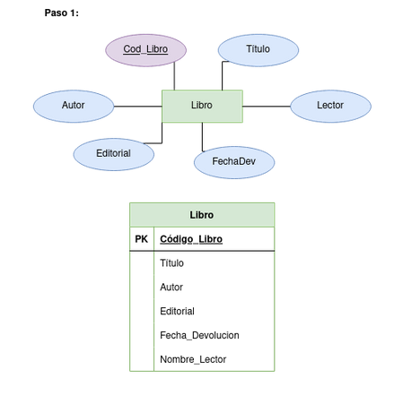
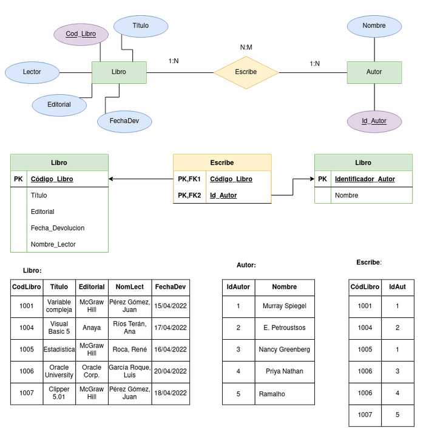
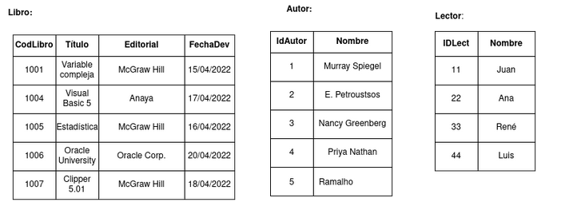
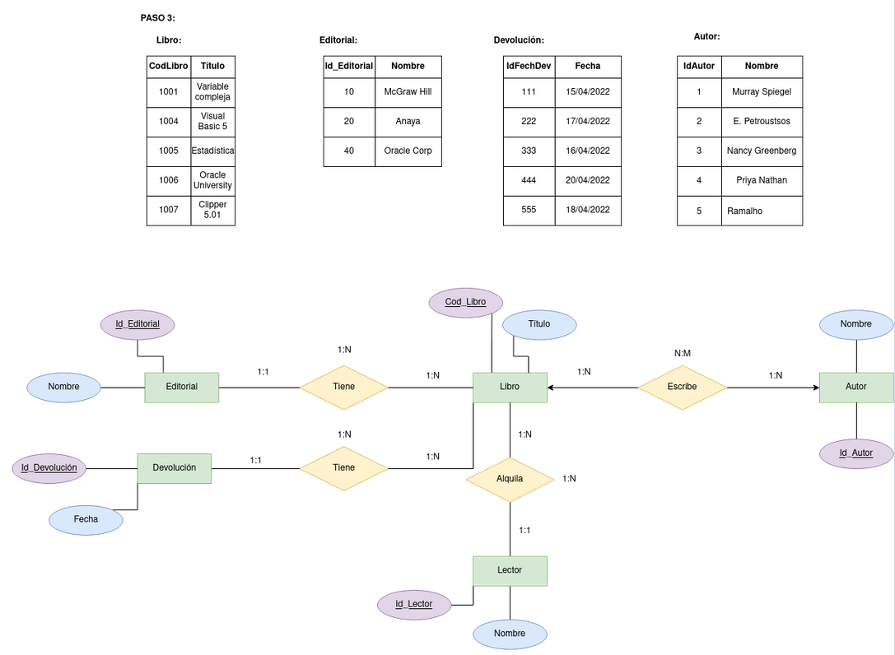
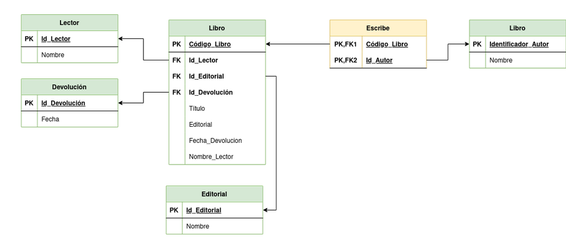

# EJERCICIO NORMALIZACIÓN LIBRERÍA

1. En primer lugar vamos a definir las claves candidatas. En esta tabla, y de primeras parece que no habrá ninguna clave candidata. A lo largo del ejercicio veremos si esto va cambiando. Partimos de la base de la siguiente imagen: 
  

2. Como vemos, no se cumple la primera forma normal porque la columna autor es una multivaluada. Por esa razón esta va a generar una tabla nueva. De esta forma, extraemos autor como una nueva tabla o entidad y establecemos la relación, que queda como una N:M, puesto que un autor puede escribir varios libros y un libro puede ser escrito por varios autores. 
  

3. Una vez aplicada la 1º forma normal, pasaremos a analizar si cumple la segunda. En la nueva tabla de autor solo tenemos la columna de identificador y otra con el atributo nombre, y guardan relación asi que está queda exactamente igual. En la parte de la tabla de libro, el nombre de Lector no podemos extraerlo con el código del libro. De esta forma nos queda una nueva tabla/entidad:
  
  

4. Y con todo esto hecho ya, miramos si cumplimos la 3º forma normal. Como vemos, en la tabla libro tenemos transitividad con todos los atributos asi que generamos tablas nuevas, y de esta forma nos queda la siguientes tablas/entidades:  
  
