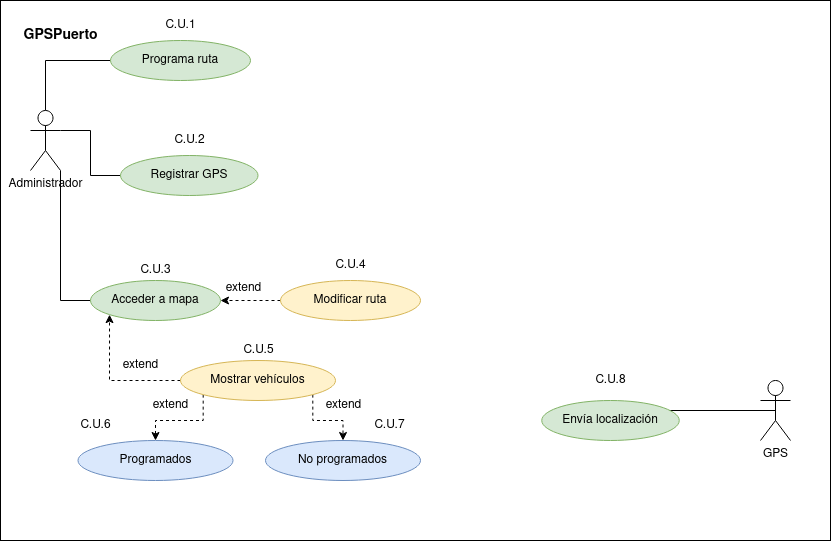

# Tarea 10: Diagramas de casos de uso. Aplicación GPSPuerto
***Del siguiente ejercicio, realizar diagrama casos de uso y la especificación del mismo:***  

Una empresa de transporte de mercancías quiere hacer una supervisión de todos los camiones de los que dispone. Para eso ha diseñado una nueva aplicación web llamada GPSPuerto.

En esta aplicación un administrador registra unos GPS especiales con 4G y les asigna un nombre. Básicamente el nombre es la matrícula del camión o furgoneta.

Para la aplicación un GPS y un vehículo es la misma cosa.

El administrador programa unas rutas para cada transporte con una fecha/hora de salida, fecha/hora de llegada (prevista). Y de esa manera se puede conocer qué vehículos están operativos en un momento determinado.

Estos GPS envían cada 5 minutos la localización exacta del dispositivo a la web mediante comunicación 4G.

El administrador puede acceder a un mapa en el que aparecen en el mismo geolocalizados los distintos camiones y dependiendo de su ubicación puede modificar la ruta. Dentro del mismo mapa puede elegir mostrar solamente aquellos vehículos que tengan una ruta programada en ese momento. También puede pedir mostrar aquellos vehículos que no tienen ninguna ruta programada y de esa manera ver dónde se ubican por si hiciese falta realizar un porte. El administrador generalmente elige el vehículo más cerca del origen de la ruta.  

Diagrama resultante del ejercicio:
    

        
Diagrama

        
    
  

**Tablas de especificación de los casos de uso:**
   

***Actores:***
 
|Actor | Administrador|
|---|---|
|Caracteristicas | Se encarga de gestionar tanto la programación de rutas como el registro de GPS|
|Relaciones | No tiene relaciones|
|Referencias | *C.U.1 a 8*|
|Notas | -|
|Autor | Adrián Herrera Brito|
|Fecha | 17/01/2023|  

|Actor | GPS|
|---|---|
|Caracteristicas | Envía su ubicación cada 5 minutos|
|Relaciones | No tiene relaciones|
|Referencias | *C.U.9*|
|Notas | -|
|Autor | Adrián Herrera Brito|
|Fecha | 17/01/2023|  
 

***Casos de uso:***  
Caso de uso CU  | CU1 Programar ruta
--------------- | ------------------
Fuentes | Descripción del ejercicio
Actor | Administrador
Descripción | Se le establece una ruta a seguir al gps para que el vehículo haga el reparto  
Flujo básico | Se selecciona una ruta y se establece una fecha/hora de inicio y de fin 
Pre-Condiciones | -
Post-Condiciones | -
Requerimientos | Tener registrado el gps
Notas | -
Autor | Adrián Herrera Brito
Fecha | 17/01/2023  

Caso de uso CU  | CU2 Ver vehículo
--------------- | ------------------
Fuentes | Descripción del ejercicio
Actor | Administrador
Descripción | Se visualizan los vehículos para filtrar cuales están operativos y cuales no  
Flujo básico | Se ven los camiones con un gps registrado y se observan los que no están en reparto en ese momento 
Pre-Condiciones | -
Post-Condiciones | -
Requerimientos | Que el vehículo tenga un gps instalado
Notas | -
Autor | Adrián Herrera Brito
Fecha | 17/01/2023  

Caso de uso CU  | CU3 Registrar GPS
--------------- | ------------------
Fuentes | Descripción del ejercicio
Actor | Administrador
Descripción | Se registra en el sistema el gps  
Flujo básico | Se registra el gps asignandole un nombre y se ubica en un camión o furgoneta 
Pre-Condiciones | -
Post-Condiciones | -
Requerimientos | -
Notas | -
Autor | Adrián Herrera Brito
Fecha | 17/01/2023  

Caso de uso CU  | CU4 Acceder a mapa
--------------- | ------------------
Fuentes | Descripción del ejercicio
Actor | Administrador
Descripción | Se abre un mapa con la información necesaria
Flujo básico | Se abre el mapa desde el que se accederá a las rutas y vehículos
Pre-Condiciones | -
Post-Condiciones | -
Requerimientos | -
Notas | -
Autor | Adrián Herrera Brito
Fecha | 17/01/2023  

Caso de uso CU  | CU5 Modificar ruta
--------------- | ------------------
Fuentes | Descripción del ejercicio
Actor | Administrador
Descripción | Se cambia una de las rutas establecidas
Flujo básico | Se selecciona la ruta en activo y se modifica según las necesidades
Pre-Condiciones | Haber accedido al mapa
Post-Condiciones | -
Requerimientos | -
Notas | -
Autor | Adrián Herrera Brito
Fecha | 17/01/2023  

Caso de uso CU  | CU6 Mostrar vehículos
--------------- | ------------------
Fuentes | Descripción del ejercicio
Actor | Administrador
Descripción | Se visualizan los camiones que hay en el mapa
Flujo básico | Se abre el mapa y se selecciona la posibilidad de ver los vehículos con los que contamos
Pre-Condiciones | Haber accedido al mapa
Post-Condiciones | -
Requerimientos | -
Notas | -
Autor | Adrián Herrera Brito
Fecha | 17/01/2023  

Caso de uso CU  | CU7 Programados
--------------- | ------------------
Fuentes | Descripción del ejercicio
Actor | Administrador
Descripción | Se visualizan los camiones CON RUTA PROGRAMADA
Flujo básico | Se abre el mapa y se seleccionan los camiones que están en activo realizando una ruta
Pre-Condiciones | Haber accedido al mapa y haber mostrado los vehículos
Post-Condiciones | -
Requerimientos | -
Notas | -
Autor | Adrián Herrera Brito
Fecha | 17/01/2023  

Caso de uso CU  | CU8 NO programados
--------------- | ------------------
Fuentes | Descripción del ejercicio
Actor | Administrador
Descripción | Se visualizan los camiones sin ruta
Flujo básico | Se abre el mapa y se selecciona la posibilidad de ver los vehículos que están parados o sin ruta establecida
Pre-Condiciones | Haber accedido al mapa y haber mostrado los vehículos
Post-Condiciones | -
Requerimientos | -
Notas | -
Autor | Adrián Herrera Brito
Fecha | 17/01/2023  

Caso de uso CU  | CU9 Enviar localización
--------------- | ------------------
Fuentes | Descripción del ejercicio
Actor | GPS
Descripción | Se envía la ubicación en la que se encuentra cada 5 minutos
Flujo básico | De forma automática el gps envía su ubicación cada 5 minutos a la aplicación para conocer donde se sitúa
Pre-Condiciones | -
Post-Condiciones | -
Requerimientos | Tener un gps registrado en el vehículo
Notas | -
Autor | Adrián Herrera Brito
Fecha | 17/01/2023  

