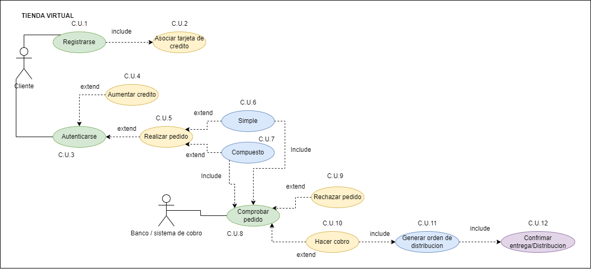

# DIAGRAMA CASO DE USO TIENDA VIRTUAL

El sistema tendrá que gestionar las cuentas de los clientes que realizan pedidos de productos del negocio. Cada producto tiene un stock determinado. Generalmente un cliente tiene una o varias cuentas para pagar los pedidos y cada cuenta tiene asociada una tarjeta de crédito con una cantidad disponible de dinero. Esa cantidad puede aumentarse por parte del cliente para poder realizar más pedidos.

Los clientes que quieran realizar un pedido tendrán que tener alguna cuenta con saldo disponible.

Los pedidos pueden ser simples o compuestos. Un pedido simple solamente tendrá una cuenta de pago y como mucho tendrá 20 productos.

Un pedido compuesto puede tener dos o más pedidos (simples o compuestos). Obviamente un pedido compuesto se tiene que pagar con la cuenta de un mismo cliente.

Solamente se pueden pedir productos que estén en stock.

Los cobros se hacen diariamente a las 23:59 horas. En ese procedimiento de cobro se comprueban todos los pedidos pendientes de cobro y se cobran de las cuentas de los clientes. Si una cuenta de cliente NO tiene dinero suficiente se RECHAZA el pedido (tanto si es simple como si forma parte de un pedido compuesto).

Una vez superado este proceso se genera la orden de distribución y confirma los pedidos.

Los pedidos listos de reparto se entregan y una vez entregados su estado pasa a estar confirmado.

- Dibujo diagrama caso de uso:
    

        
Diagrama

        
    
  

- Especificacion de casos de uso:
***Actores:***
 
|Actor | Cliente|
|---|---|
|Caracteristicas | Es el usuario que se registra y puede realizar compras / pedidos
|Relaciones | No tiene relaciones|
|Referencias |*C.U.1 a 7* |
|Notas | -|
|Autor | Adrián Herrera Brito|
|Fecha | 24/01/2023|  

|Actor | Banco/Sistema de cobro|
|---|---|
|Caracteristicas | Es el encargado de aceptar o rechazar el pedido segun haya o no saldo|
|Relaciones | No tiene relaciones|
|Referencias | *C.U.8 a 12* |
|Notas | -|
|Autor | Adrián Herrera Brito|
|Fecha | 24/01/2023|  
 

***Casos de uso:***  
Caso de uso CU  | C.U.1 Registrarse
--------------- | ------------------
Fuentes | Descripción del ejercicio
Actor | Cliente
Descripción | El cliente se crea una cuenta en la pagina de la tineda virtual con sus datos
Flujo básico | Se crea una nueva cuenta en la que se solicitan datos (correo, nombre, edad...)
Pre-Condiciones | -
Post-Condiciones | Incluye asociar una tarjeta de credito a la cuenta
Requerimientos | --
Notas | -
Autor | Adrián Herrera Brito
Fecha | 24/01/2023

Caso de uso CU  | C.U.2 Asociar tarjeta 
--------------- | ------------------
Fuentes | Descripción del ejercicio
Actor | Cliente
Descripción | A la cuenta creada se le asocia una tarjeta para poder pagar
Flujo básico | Una vez registrado, el cliente debera asociar una tarjeta de credito 
Pre-Condiciones | Haberse registrado
Post-Condiciones | -
Requerimientos | --
Notas | -
Autor | Adrián Herrera Brito
Fecha | 24/01/2023

Caso de uso CU  | C.U.3 Autenticarse
--------------- | ------------------
Fuentes | Descripción del ejercicio
Actor | Cliente
Descripción | El cliente se identifica / autentica para realizar el resto de acciones 
Flujo básico | El cliente introduce las credenciales necesarias para autenticarse y poder realziar acciones posteriores
Pre-Condiciones | --
Post-Condiciones | -
Requerimientos | Tener una cuenta ya registrada
Notas | -
Autor | Adrián Herrera Brito
Fecha | 24/01/2023

Caso de uso CU  | C.U.4 Aumentar credito
--------------- | ------------------
Fuentes | Descripción del ejercicio
Actor | Cliente
Descripción | Se aumenta el saldo disponible para gastar en la tienda
Flujo básico | Se añade credito al saldo disponible de la cuenta para poder gastar
Pre-Condiciones | Haberse autenticado
Post-Condiciones | -
Requerimientos | -
Notas | -
Autor | Adrián Herrera Brito
Fecha | 24/01/2023

Caso de uso CU  | C.U.5 Realizar pedido
--------------- | ------------------
Fuentes | Descripción del ejercicio
Actor | Cliente
Descripción | Se piden articulos de la tienda
Flujo básico | Una vez autenticado, se seleccionan unos articulos que se quieran comprar
Pre-Condiciones | Haberse autenticado
Post-Condiciones | Seleccionar el tipo de pedido
Requerimientos | Que los articulos que se pidan esten en stock
Notas | -
Autor | Adrián Herrera Brito
Fecha | 24/01/2023

Caso de uso CU  | C.U.6 Pedido simple
--------------- | ------------------
Fuentes | Descripción del ejercicio
Actor | Cliente
Descripción | Se selecciona el pedido simple
Flujo básico | Si los articulos seleccionados son menos de 20, se selecciona este tipo de pedido
Pre-Condiciones | Haber realizado un pedido
Post-Condiciones | -
Requerimientos | Que hayan menos de 20 articulos
Notas | -
Autor | Adrián Herrera Brito
Fecha | 24/01/2023

Caso de uso CU  | C.U.7 Pedido compuesto
--------------- | ------------------
Fuentes | Descripción del ejercicio
Actor | Cliente
Descripción | Se selecciona pedido compuesto
Flujo básico | Si hay mas de 20 articulos, se selecciona el pedido complejo
Pre-Condiciones | Haber realziado un pedido
Post-Condiciones | -
Requerimientos | Que los articulos sean superiores a 20
Notas | -
Autor | Adrián Herrera Brito
Fecha | 24/01/2023

Caso de uso CU  | C.U.8 Comprobar pedido
--------------- | ------------------
Fuentes | Descripción del ejercicio
Actor | Banco / Sistema de cobro
Descripción | Se comprueba si se puede o no realizar el pago
Flujo básico | Se comprueba si el cliente dispone del saldo suficiente para poder realizar el pedido
Pre-Condiciones | Que haya un pedido realizado por algun cliente
Post-Condiciones | -
Requerimientos | -
Notas | -
Autor | Adrián Herrera Brito
Fecha | 24/01/2023

Caso de uso CU  | C.U.9 Rechazar pedido
--------------- | ------------------
Fuentes | Descripción del ejercicio
Actor | Banco/Sistema de cobro
Descripción | Se rechaza el pedido y no se completa
Flujo básico | Si el cliente no dispone de credito suficiente, se rechaza el pedido
Pre-Condiciones | Haber comprobado el pedido
Post-Condiciones | -
Requerimientos | --
Notas | -
Autor | Adrián Herrera Brito
Fecha | 24/01/2023  

Caso de uso CU  | C.U.10 Hacer cobro
--------------- | ------------------
Fuentes | Descripción del ejercicio
Actor | Banco/Sistema de cobro
Descripción | Se acepta el pedido y se cobra 
Flujo básico | Si el cliente dispone del saldo suficiente, el sistema hace el cobro de la tarjeta del cliente
Pre-Condiciones | Haber comprobado el pedido
Post-Condiciones | -
Requerimientos | --
Notas | -
Autor | Adrián Herrera Brito
Fecha | 24/01/2023  

Caso de uso CU  | C.U.11 Generar orden distribucion
--------------- | ------------------
Fuentes | Descripción del ejercicio
Actor | Banco/Sistema de cobro
Descripción | Se genera una "factura" con la orden de reparto/distribucion
Flujo básico | Una vez hecho el cobro, se genera la orden de distribucion con los datos del cliente para que el pedido se reparta y se confirme su pago
Pre-Condiciones | Que el pedido haya sido cobrado
Post-Condiciones | -
Requerimientos | --
Notas | -
Autor | Adrián Herrera Brito
Fecha | 24/01/2023  

Caso de uso CU  | C.U.12 Confirmar distribucion
--------------- | ------------------
Fuentes | Descripción del ejercicio
Actor | Banco/Sistema de cobro
Descripción | Se confirma que el pedido ha sido recibido por el cliente
Flujo básico | Una vez el pedido ha llegado al cliente el pedido pasa a estar confirmado
Pre-Condiciones | Que se haya generado la orden de distribucion
Post-Condiciones | -
Requerimientos | --
Notas | -
Autor | Adrián Herrera Brito
Fecha | 24/01/2023