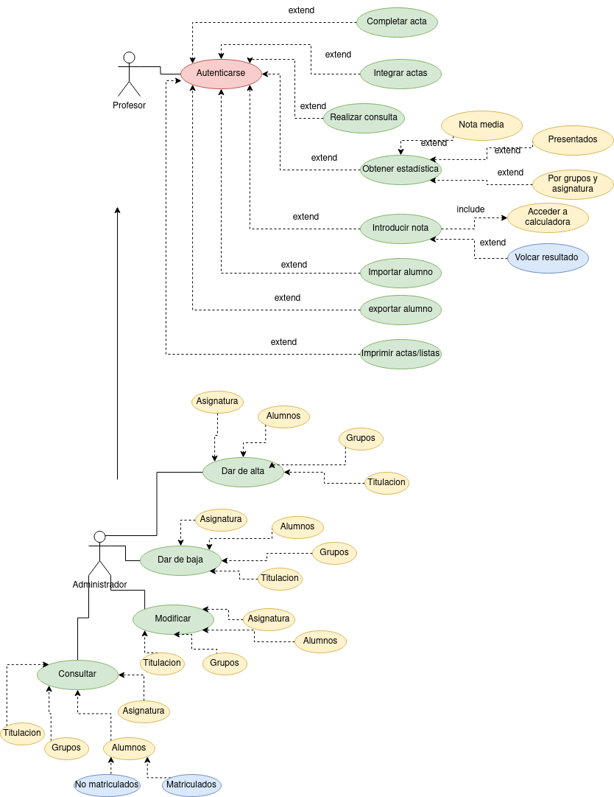

# Gestión Centro de profesores:
Se desea desarrollar una aplicación de gestión de las calificaciones de los alumnos para satisfacer las numerosas quejas de los profesores, por el uso del lápiz y papel. La aplicación debe de cumplir los temas que se describen a continuación: El profesor recibe las actas en blanco de las asignaturas de las que es responsable, en formato electrónico. El acta contiene los siguientes datos de la asignatura (titulación,campus, curso académico, denominación de la asignatura, convocatoria y grupo) y la lista de alumnos matriculados (niu, nif, nombre y apellidos). Alguna de las acciones que puede hacer el profesor son:

Completar un acta con las notas de los alumnos.
Añadir o borrar un alumno de un acta.
Integrar las actas de varios grupos de una misma asignatura en una sola acta.
Otras de las opciones que se le exige a la aplicación, para satisfacer completamente las necesidades del profesor, son las siguientes:
Permitir la consulta de la siguiente información de cualquier alumno seleccionado DNI, N.° EXPEDIENTE, Lista de asignaturas en las que está matriculado el alumno (Código asignatura-Nombre asignatura).
Obtener una estadística de las calificaciones obtenidas por los alumnos en un determinado grupo de una asignatura. En esta estadística se tendrá para cada posible calificación:
Número de personas con esa calificación, Porcentaje sobre los presentados, Porcentaje sobre el total del grupo.
Consultar el porcentaje de personas sobre el total del grupo que se han presentado y el de los que no se han presentado.
Poder visualizar un gráfico indicativo del número de personas que han obtenido una calificación entre 0-0.99, 1-1.99, 2-2.99, 3-3.99, 4-4.99, 5-5.99, 6-6.99, 8-8.99, 9-10; indicándose la nota media obtenida por la clase.
Disponer de una calculadora que permita realizar las operaciones de suma, resta, multiplicación, división. Esta calculadora se activará cuando se vayan a introducir las notas a algún alumno de forma que una vez realizada la operación aritmética, pulsando un botón se vuelque el resultado en la casilla donde se están introduciendo las calificaciones, redondeándose a dos cifras decimales.
Permitir la importación y exportación de la lista de alumnos con sus calificaciones a un formato compatible con MS Excel.
Imprimir las actas y la lista provisional de calificaciones.

Finalmente, como una ampliación extra, a la cual sólo podrá acceder quien se identifique inicialmente como administrador de la aplicación, se deben permitir:

CRUD (Altas/Bajas/Modificación y Consulta) para cada uno de los siguientes grupos:.
Asignaturas, teniendo en cuenta que una asignatura sólo se puede dar en un único curso (primero, segundo, tercero...) y que cada curso está formado ponlos datos sobre el número máximo de alumnos, número mínimo de créditos troncales y número mínimo de créditos optativos. Algunos de los datos que vamos a poder consultar de una asignatura son el nombre, número de créditos y cuatrimestre en el que se imparte.
Titulaciones, teniendo en cuenta que una titulación sólo se da en un campus determinado y los datos que podemos consultar son el nombre, el número de créditos o carga lectiva global, si es de 1.° o 2.' ciclo, ...
Grupos, en los que podemos consultar el número máximo de alumnos permitidos, si es un grupo de mañana, de tarde o de noche, y cuál es el código empleado para identificar el grupo.
Alumnos:
Consultar aquellos alumnos que no se pueden matricular y el motivo de ello.
Consultar el historial académico de un alumno.

- Diagrama del programa:
    

        
Solución

        
    

- Especificaciones de uso: 
***Actores:***
 
|Actor | Profesor|
|---|---|
|Caracteristicas | Se encaga de realizar las funciones relacionadas con el alumno y con las notas
|Relaciones | No tiene relaciones|
|Referencias |*C.U.1 a 13* |
|Notas | -|
|Autor | Adrián Herrera Brito|
|Fecha | 1/02/2023|  

|Actor | Administrador|
|---|---|
|Caracteristicas | Es el encargado de realizar acciones extra de tipo CRUD en más ámbitos que alumno
|Relaciones | Se relaciona con el profesor puesto que puede realizar los mismos casos de uso|
|Referencias | *C.U.13 a 34* |
|Notas | -|
|Autor | Adrián Herrera Brito|
|Fecha | 1/02/2023|  
 

***Casos de uso:***  
Caso de uso CU  | C.U.1 Autenticarse
--------------- | ------------------
Fuentes | Descripción del ejercicio
Actor | Profesor
Descripción | El profesor se identifica en la aplicación para poder realizar el resto de acciones que puede realizar
Flujo básico | El profesor se inicia mediante sus credenciales en la aplicación para que se le reconozca como profesor
Pre-Condiciones | -
Post-Condiciones | -
Requerimientos | Ser un profesor con credenciales válidas que permitan acceder a la aplicación
Notas | -
Autor | Adrián Herrera Brito
Fecha | 1/02/2023

Caso de uso CU  | C.U.2 Completar acta
--------------- | ------------------
Fuentes | Descripción del ejercicio
Actor | Profesor
Descripción | El profesor completa el acta de un alumno con la nota que haya obtenido 
Flujo básico | Una vez autenticado, el profesor completa el acta del alumno que necesite añadiendo su nota
Pre-Condiciones | Haberse autenticado
Post-Condiciones | -
Requerimientos | --
Notas | -
Autor | Adrián Herrera Brito
Fecha | 1/02/2023

Caso de uso CU  | C.U.3 Integrar actas
--------------- | ------------------
Fuentes | Descripción del ejercicio
Actor | Profesor
Descripción | El profesor tiene la posibilidad de unir las actas de varios grupos en un solo acta para poder "sintetizar" un acta por asignatura que incluya varios grupos
Flujo básico | Una vez se tenga varias actas de una misma asignatura el profesor puede unirlas en una
Pre-Condiciones | Disponer de varias actas completas de una msima asigantura pero de varios grupos
Post-Condiciones | -
Requerimientos | --
Notas | -
Autor | Adrián Herrera Brito
Fecha | 1/02/2023

Caso de uso CU  | C.U.4 Realizar consulta
--------------- | ------------------
Fuentes | Descripción del ejercicio
Actor | Profesor
Descripción | El profesor puede realizar una consulta sobre un alumno y su información para lo que sea necesario
Flujo básico | Se pueden comprobar los datos de los alumnos 
Pre-Condiciones | --
Post-Condiciones | -
Requerimientos | -
Notas | -
Autor | Adrián Herrera Brito
Fecha | 1/02/2023

Caso de uso CU  | C.U.5 Obtener estadística
--------------- | ------------------
Fuentes | Descripción del ejercicio
Actor | Profesor
Descripción | El profesor, con las actas que tiene puede sacar una estadística de varios parámetros.
Flujo básico | Se consulta una estadística de varias opciones disponibles
Pre-Condiciones | --
Post-Condiciones | --
Requerimientos | --
Notas | -
Autor | Adrián Herrera Brito
Fecha | 1/02/2023

Caso de uso CU  | C.U.6 Nota media
--------------- | ------------------
Fuentes | Descripción del ejercicio
Actor | Profesor
Descripción | Una vez se accede a la estadística de algo, esta es una de las opciones que muestra la nota media 
Flujo básico | Tras haber querido mostrar la estadística, si el profesor se va por esta opción se mostrará la nota media y el rango de notas en el que está cada alumno 
Pre-Condiciones | Haber "solicitado" la estadística
Post-Condiciones | -
Requerimientos | --
Notas | --
Autor | Adrián Herrera Brito
Fecha | 1/02/2023

Caso de uso CU  | C.U.7 Porcentaje de presentados
--------------- | ------------------
Fuentes | Descripción del ejercicio
Actor | Profesor
Descripción | Al igual que en la anterior, una vez accedido a la estadística la aplicación muestra una estadística o procentaje de los alumnos que se han presentado y que no se han presentado
Flujo básico | Si se solicita la estadística y se escoge esta opción se muestra el porcentaje de los alumnos presentados y no presentados
Pre-Condiciones | --
Post-Condiciones | --
Requerimientos | --
Notas | -
Autor | Adrián Herrera Brito
Fecha | 1/02/2023

Caso de uso CU  | C.U.8 Por grupos en asigantura
--------------- | ------------------
Fuentes | Descripción del ejercicio
Actor | Profesor
Descripción | De nuevo, una vez se ha accedido a la estadística, si se selecciona está opción el profesor podrá consultar las notas que han obtenido un grupo de alumnos en una asignatura
Flujo básico | Una vez solicitada la estadística, este camino va a mostrar la nota (normalmente media) que un grupo ha obtenido en una asignatura determinada
Pre-Condiciones | --
Post-Condiciones | --
Requerimientos | --
Notas | --
Autor | Adrián Herrera Brito
Fecha | 1/02/2023

Caso de uso CU  | C.U.9 Introducir nota
--------------- | ------------------
Fuentes | Descripción del ejercicio
Actor | Profesor
Descripción | El profesor tiene la posibilidad de introducir la nota de un alumno en el acta
Flujo básico | Cuando el profesor quiere introducir una nota se abrirá una calculadora que le permitirá realizar los cálculos que quiera si fuera necesario
Pre-Condiciones | --
Post-Condiciones | Apertura de la calculadora
Requerimientos | --
Notas | -
Autor | Adrián Herrera Brito
Fecha | 1/02/2023  

Caso de uso CU  | C.U.10 Acceder a calculadora
--------------- | ------------------
Fuentes | Descripción del ejercicio
Actor | Profesor
Descripción | Cuando se quiere introducir una nota, la calculadora se abre para que el profesor pueda realizar varias operaciones (suma, resta, multiplicación y división) para luego volcar la nota 
Flujo básico | Una vez el profesor haya decidido introducir la nota, se abre la calculadora para permitir hacer los cálculos necesarios
Pre-Condiciones | Haber comenzado el proceso de introducir la nota
Post-Condiciones | Volcar la nota que se haya calculado, en caso de haber hecho una operación
Requerimientos | --
Notas | -
Autor | Adrián Herrera Brito
Fecha | 1/02/2023  

Caso de uso CU  | C.U.11 Generar orden distribucion
--------------- | ------------------
Fuentes | Descripción del ejercicio
Actor | Banco/Sistema de cobro
Descripción | Se genera una "factura" con la orden de reparto/distribucion
Flujo básico | Una vez hecho el cobro, se genera la orden de distribucion con los datos del cliente para que el pedido se reparta y se confirme su pago
Pre-Condiciones | Que el pedido haya sido cobrado
Post-Condiciones | -
Requerimientos | --
Notas | -
Autor | Adrián Herrera Brito
Fecha | 24/01/2023  

Caso de uso CU  | C.U.12 Volcar resultado
--------------- | ------------------
Fuentes | Descripción del ejercicio
Actor | Profesor
Descripción | Una vez hecha la operación, se vuelca el resultado en el acta del alumno
Flujo básico | Con la nota definitiva decidida, se vuelca esa nota al acta del alumno, grupo, asignatura...
Pre-Condiciones | Haber accedido a la calculadora, aunque no se haga una operación
Post-Condiciones | --
Requerimientos | --
Notas | -
Autor | Adrián Herrera Brito
Fecha | 1/02/2023  

Caso de uso CU  | C.U.13 Volcar resultado
--------------- | ------------------
Fuentes | Descripción del ejercicio
Actor | Profesor
Descripción | Una vez hecha la operación, se vuelca el resultado en el acta del alumno
Flujo básico | Con la nota definitiva decidida, se vuelca esa nota al acta del alumno, grupo, asignatura...
Pre-Condiciones | Haber accedido a la calculadora, aunque no se haga una operación
Post-Condiciones | --
Requerimientos | --
Notas | -
Autor | Adrián Herrera Brito
Fecha | 1/02/2023  

Caso de uso CU  | C.U.14 Importar alumno
--------------- | ------------------
Fuentes | Descripción del ejercicio
Actor | Profesor
Descripción | Se permite al profesor importar la lista de actas de los alumnos con sus notas en un formato compatible con excel
Flujo básico | Se importan las actas de una serie de alumnos en un formato compatible con Excel.
Pre-Condiciones | --
Post-Condiciones | --
Requerimientos | --
Notas | -
Autor | Adrián Herrera Brito
Fecha | 1/02/2023  

Caso de uso CU  | C.U.15 Exportar alumno
--------------- | ------------------
Fuentes | Descripción del ejercicio
Actor | Profesor
Descripción | Se permite al profesor exportar la lista de actas de los alumnos con sus notas en un formato compatible con excel
Flujo básico | Se exportan las actas de una serie de alumnos en un formato compatible con Excel.
Pre-Condiciones | --
Post-Condiciones | --
Requerimientos | --
Notas | -
Autor | Adrián Herrera Brito
Fecha | 1/02/2023  

Caso de uso CU  | C.U.16 Imprimir actas
--------------- | ------------------
Fuentes | Descripción del ejercicio
Actor | Profesor
Descripción | Se permite al profesor imprimir las actas que quiera consultar
Flujo básico | Se permite al profesor imprimir las actas de los alumnos que necesite
Pre-Condiciones | --
Post-Condiciones | --
Requerimientos | --
Notas | -
Autor | Adrián Herrera Brito
Fecha | 1/02/2023  

Caso de uso CU  | C.U.17 Dar de alta
--------------- | ------------------
Fuentes | Descripción del ejercicio
Actor | Administrador
Descripción | El administrador, que puede realizar todas las acciones que hace el profesor, además podrá dar de alta a una serie de opciones.
Flujo básico | Una vez autenticado, el administrador puede dar de alta a un nuevo campo entre las diferentes opciones que tiene
Pre-Condiciones | Haberse autenticado
Post-Condiciones | Seleccionar la opción sobre el campo al que dar de alta
Requerimientos | --
Notas | -
Autor | Adrián Herrera Brito
Fecha | 1/02/2023 

Caso de uso CU  | C.U.17 Asignatura
--------------- | ------------------
Fuentes | Descripción del ejercicio
Actor | Administrador
Descripción | Dentro de las opciones de dar de alta, una de ellas es dar de alta a una nueva asignatura
Flujo básico | Una vez se quiera dar de alta, se selecciona este campo en caso de que se quiera dar de alta a una asignatura
Pre-Condiciones | --
Post-Condiciones | --
Requerimientos | --
Notas | --
Autor | Adrián Herrera Brito
Fecha | 1/02/2023  

Caso de uso CU  | C.U.18 Alumnos
--------------- | ------------------
Fuentes | Descripción del ejercicio
Actor | Administrador
Descripción | Dentro de las opciones de dar de alta, una de ellas es dar de alta a un nuevo alumno
Flujo básico | Una vez se quiera dar de alta, se selecciona este campo en caso de que se quiera dar de alta a un alumno
Pre-Condiciones | --
Post-Condiciones | --
Requerimientos | --
Notas | --
Autor | Adrián Herrera Brito
Fecha | 1/02/2023  

Caso de uso CU  | C.U.19 Grupo
--------------- | ------------------
Fuentes | Descripción del ejercicio
Actor | Administrador
Descripción | Dentro de las opciones de dar de alta, una de ellas es dar de alta a un grupo
Flujo básico | Una vez se quiera dar de alta, se selecciona este campo en caso de que se quiera dar de alta a un grupo
Pre-Condiciones | --
Post-Condiciones | --
Requerimientos | --
Notas | --
Autor | Adrián Herrera Brito
Fecha | 1/02/2023  

Caso de uso CU  | C.U.20 Titulación
--------------- | ------------------
Fuentes | Descripción del ejercicio
Actor | Administrador
Descripción | Dentro de las opciones de dar de alta, una de ellas es dar de alta a una tituñación
Flujo básico | Una vez se quiera dar de alta, se selecciona este campo en caso de que se quiera dar de alta a una tituñación
Pre-Condiciones | --
Post-Condiciones | --
Requerimientos | --
Notas | --
Autor | Adrián Herrera Brito
Fecha | 1/02/2023  

Caso de uso CU  | C.U.21 Dar de baja
--------------- | ------------------
Fuentes | Descripción del ejercicio
Actor | Administrador
Descripción | El administrador, que puede realizar todas las acciones que hace el profesor, además podrá dar de de baja o eliminar alguna de las opciones que se le ofrecen
Flujo básico | Una vez autenticado, el administrador puede dar de baja o eliminar a un nuevo campo entre las diferentes opciones que tiene
Pre-Condiciones | Haberse autenticado
Post-Condiciones | Seleccionar la opción sobre el campo al que dar de baja
Requerimientos | --
Notas | -
Autor | Adrián Herrera Brito
Fecha | 1/02/2023  

Caso de uso CU  | C.U.22 Asignatura
--------------- | ------------------
Fuentes | Descripción del ejercicio
Actor | Administrador
Descripción | Dentro de las opciones de dar de baja, una de ellas es eliminar a de las existentes asignatura
Flujo básico | Una vez se quiera dar de baja, se selecciona este campo en caso de que se quiera eliminar una asignatura
Pre-Condiciones | --
Post-Condiciones | --
Requerimientos | --
Notas | --
Autor | Adrián Herrera Brito
Fecha | 1/02/2023  

Caso de uso CU  | C.U.23 Alumnos
--------------- | ------------------
Fuentes | Descripción del ejercicio
Actor | Administrador
Descripción | Dentro de las opciones de dar de baja, una de ellas es eliminar a un alumno
Flujo básico | Una vez se quiera dar de baja, se selecciona este campo en caso de que se quiera eliminar a uno de los alumnos
Pre-Condiciones | --
Post-Condiciones | --
Requerimientos | --
Notas | --
Autor | Adrián Herrera Brito
Fecha | 1/02/2023  

Caso de uso CU  | C.U.24 Grupos
--------------- | ------------------
Fuentes | Descripción del ejercicio
Actor | Administrador
Descripción | Dentro de las opciones de dar de baja, una de ellas es eliminar a de los grupos
Flujo básico | Una vez se quiera dar de baja, se selecciona este campo en caso de que se quiera eliminar un grupo
Pre-Condiciones | --
Post-Condiciones | --
Requerimientos | --
Notas | --
Autor | Adrián Herrera Brito
Fecha | 1/02/2023  

Caso de uso CU  | C.U.25 Titulación
--------------- | ------------------
Fuentes | Descripción del ejercicio
Actor | Administrador
Descripción | Dentro de las opciones de dar de baja, una de ellas es eliminar una titulación
Flujo básico | Una vez se quiera dar de baja, se selecciona este campo en caso de que se quiera eliminar una titulación
Pre-Condiciones | --
Post-Condiciones | --
Requerimientos | --
Notas | --
Autor | Adrián Herrera Brito
Fecha | 1/02/2023  

Caso de uso CU  | C.U.26 Modificar
--------------- | ------------------
Fuentes | Descripción del ejercicio
Actor | Administrador
Descripción | El administrador, que puede realizar todas las acciones que hace el profesor, además podrá modificar información acerca de alguna de las opciones que se le ofrecen
Flujo básico | Una vez autenticado, el administrador puede modificar a un nuevo campo entre las diferentes opciones que tiene
Pre-Condiciones | Haberse autenticado
Post-Condiciones | Seleccionar la opción sobre el campo al que modificar
Requerimientos | --
Notas | -
Autor | Adrián Herrera Brito
Fecha | 1/02/2023  

Caso de uso CU  | C.U.27 Asignatura
--------------- | ------------------
Fuentes | Descripción del ejercicio
Actor | Administrador
Descripción | Dentro de las opciones de modificación, una de ellas es editar las asignaturas
Flujo básico | Una vez se quiera modificar algún dato, se selecciona este campo en caso de que se quiera editar alguna asignatura
Pre-Condiciones | --
Post-Condiciones | --
Requerimientos | --
Notas | --
Autor | Adrián Herrera Brito
Fecha | 1/02/2023  

Caso de uso CU  | C.U.28 Alumnos
--------------- | ------------------
Fuentes | Descripción del ejercicio
Actor | Administrador
Descripción | Dentro de las opciones de modificación, una de ellas es editar a un alumno
Flujo básico | Una vez se quiera modificar algo, se selecciona este campo en caso de que se quiera editar a uno de los alumnos
Pre-Condiciones | --
Post-Condiciones | --
Requerimientos | --
Notas | --
Autor | Adrián Herrera Brito
Fecha | 1/02/2023  

Caso de uso CU  | C.U.29 Grupos
--------------- | ------------------
Fuentes | Descripción del ejercicio
Actor | Administrador
Descripción | Dentro de las opciones de modificación, una de ellas es editar a los grupos
Flujo básico | Una vez se quiera modificar algo, se selecciona este campo en caso de que se quiera editar un grupo
Pre-Condiciones | --
Post-Condiciones | --
Requerimientos | --
Notas | --
Autor | Adrián Herrera Brito
Fecha | 1/02/2023  

Caso de uso CU  | C.U.30 Titulación
--------------- | ------------------
Fuentes | Descripción del ejercicio
Actor | Administrador
Descripción | Dentro de las opciones de modificación, una de ellas es editar una titulación
Flujo básico | Una vez se quiera modificar, se selecciona este campo en caso de que se quiera editar una titulación
Pre-Condiciones | --
Post-Condiciones | --
Requerimientos | --
Notas | --
Autor | Adrián Herrera Brito
Fecha | 1/02/2023  

Caso de uso CU  | C.U.31 Consultar
--------------- | ------------------
Fuentes | Descripción del ejercicio
Actor | Administrador
Descripción | El administrador, que puede realizar todas las acciones que hace el profesor, además podrá consultar o mostrar la información acerca de alguna de las opciones que se le ofrecen
Flujo básico | Una vez autenticado, el administrador puede mostrar el contenido de un campo entre las diferentes opciones que tiene
Pre-Condiciones | Haberse autenticado
Post-Condiciones | Seleccionar la opción sobre el campo al que se consulta
Requerimientos | --
Notas | -
Autor | Adrián Herrera Brito
Fecha | 1/02/2023  

Caso de uso CU  | C.U.32 Asignatura
--------------- | ------------------
Fuentes | Descripción del ejercicio
Actor | Administrador
Descripción | Dentro de las opciones de consulta, una de ellas es mostrar las asignaturas
Flujo básico | Una vez se quiera consultar algún dato, se selecciona este campo en caso de que se quiera mostrar alguna asignatura
Pre-Condiciones | --
Post-Condiciones | --
Requerimientos | --
Notas | --
Autor | Adrián Herrera Brito
Fecha | 1/02/2023  

Caso de uso CU  | C.U.33 Alumnos
--------------- | ------------------
Fuentes | Descripción del ejercicio
Actor | Administrador
Descripción | Dentro de las opciones de consulta, una de ellas es mostrar la información de un alumno
Flujo básico | Una vez se quiera mostrar algo, se selecciona este campo en caso de que se quiera consultar a uno de los alumnos
Pre-Condiciones | --
Post-Condiciones | Seleccionar que tipo de alumno queremos consultar
Requerimientos | --
Notas | --
Autor | Adrián Herrera Brito
Fecha | 1/02/2023  

Caso de uso CU  | C.U.34 Alumno matriculado
--------------- | ------------------
Fuentes | Descripción del ejercicio
Actor | Administrador
Descripción | Se selecciona al alumno que ya tiene una matricula
Flujo básico | Una vez se quiera consultar algo sobre el alumno, esta opción filtra los alumnos que ya tienen matrícula
Pre-Condiciones | --
Post-Condiciones | --
Requerimientos | --
Notas | --
Autor | Adrián Herrera Brito
Fecha | 1/02/2023  

Caso de uso CU  | C.U.35 Alumno NO matriculado
--------------- | ------------------
Fuentes | Descripción del ejercicio
Actor | Administrador
Descripción | Se selecciona al alumno que no tiene una matricula
Flujo básico | Una vez se quiera consultar algo sobre el alumno, esta opción filtra los alumnos que no tienen matrícula
Pre-Condiciones | --
Post-Condiciones | --
Requerimientos | --
Notas | --
Autor | Adrián Herrera Brito
Fecha | 1/02/2023 

Caso de uso CU  | C.U.36 Grupos
--------------- | ------------------
Fuentes | Descripción del ejercicio
Actor | Administrador
Descripción | Dentro de las opciones de consulta, una de ellas es mostrar a los grupos
Flujo básico | Una vez se quiera consultar algo, se selecciona este campo en caso de que se quiera comprobar algún grupo
Pre-Condiciones | --
Post-Condiciones | --
Requerimientos | --
Notas | --
Autor | Adrián Herrera Brito
Fecha | 1/02/2023  

Caso de uso CU  | C.U.37 Titulación
--------------- | ------------------
Fuentes | Descripción del ejercicio
Actor | Administrador
Descripción | Dentro de las opciones de consulta, una de ellas es mostrar una titulación
Flujo básico | Una vez se quiera mostrar algo, se selecciona este campo en caso de que se quiera consultar una titulación
Pre-Condiciones | --
Post-Condiciones | --
Requerimientos | --
Notas | --
Autor | Adrián Herrera Brito
Fecha | 1/02/2023 

