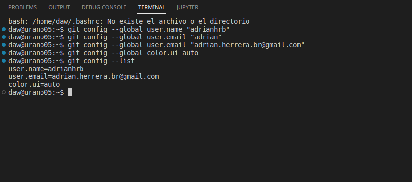
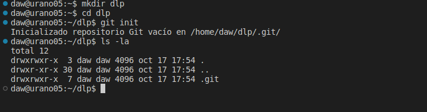
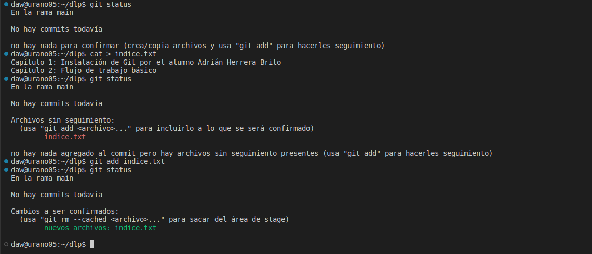
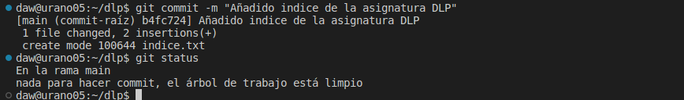
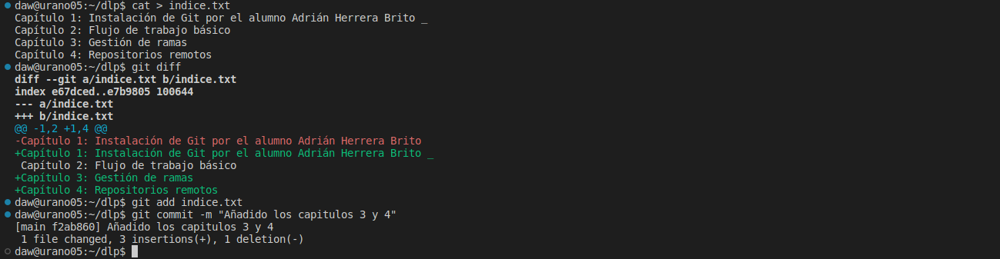
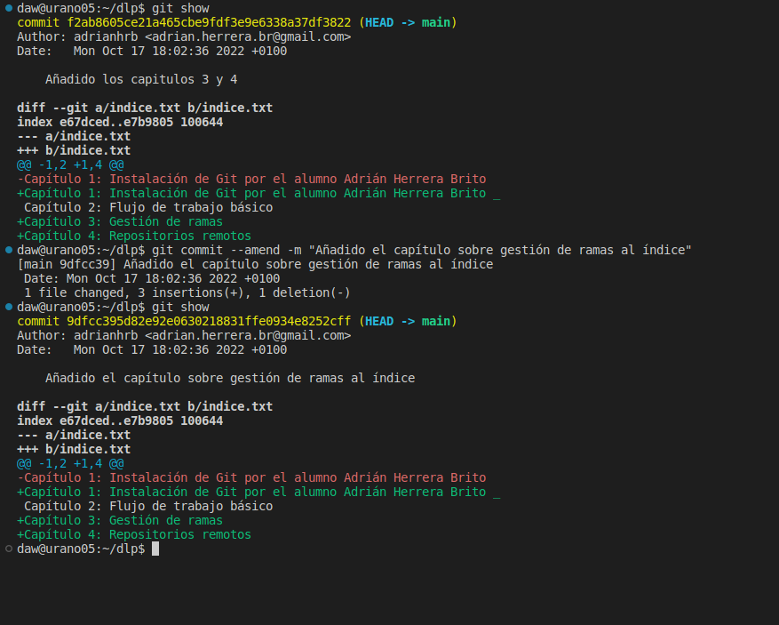

# **INICIACIÓN AL USO DE GIT**

-------

# MANIPULACIÓN BÁSICA DE GIT
## ***DESCRIPCIÓN:***
1. En primer lugar, para hacer la configuración previa vamos a "identificarnos", poniendo de esta forma nuestro correo electrónico y nuestro username entre otras cosas como darle color a la terminal para que visualmente sea más sencillo trabajar. Aquí tenemos los pasos descritos:  
  

2. En segundo lugar, vamos a crear un repositorio para luego, mostrar su contenido. Siguiendo los pasos obtenemos una carpeta con el comando mkdir, luego con el comando cd entramos en esa carpeta:  
  

3. Una vez hecho, vamos a comprobar el estado del repositorio y dentro de la carpeta en la que ya estamos vamos a crear un fichero con la información que se solicita en la tarea. Luego, comprobamos de nuevo el estado del repositorio, y añadimos los cambios para dejarlos pendientes de commit:   

4. Continuando la tarea, vamos a hacer un commit sobre lo que hemos hecho anteriormente, de esta forma vamos paso a paso commiteando lo que vamos haciendo, que siempre será mucho mejor que hacer cambios enormes y añadir un solo commit:   

5. Con todo esto finalizado, vamos a modificar los ficheros que hemos creado. En este caso, añadiremos información extra, compararemos los estados del antrerior fichero y del actual con los cambios añadidos, añadioremos esos cambios y haremos el commit:   

6. Por último, vamos a ver el historial del repositorio, modificar el último commit que hemos hecho y volver a mostrar los cambios que ha sufrido el repositorio:   

[Segunda parte de la tarea, manipulación avanzada de git](Tarea3.2/Readme.md)

