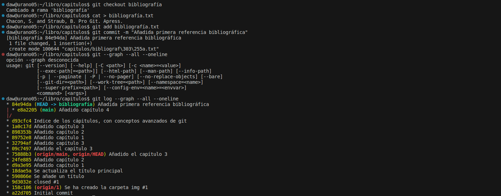

# MANIPULACIÓN AVANZADA DE GIT  

## ***Descripción:***  
1. En primer lugar, vamos a ver en la terminal el historial de cambios. Después de ello, creamos una carpeta llamada capitulos en la que vamos a crear varios ficheros. El primero de ellos será el fichero capítulo1.txt al que le añadiremos lo que se solicita en la tarea. Una vez hecho, añadimos cambios, hacemos el respectivo commit de ello y por último, volvemos a ver el historial de cambios: 

2. En segundo lugar, crearemos otro fichero capítulo2.txt y repetiremos como en el paso anterior (añadir cambios y hacer commit), para luego mostrar las diferencias entre versiones:   

3. En tercer lugar, repetimos el paso anterior pero esta vez compararemos los resultados entre la primera y la última version del repo:     
  

4. Esta vez, haremos un fichero como índice y, repitiendo los pasos de añadir y commitear, miraremos quién ha hecho cambios en este fichero:   

5. Creamos una rama llamda bibliografía y mostramos las ramas del repositorio:   

6. Repetimos como ebn los pasos anteriores con un capítulo 4.txt y esta vez, miraremos el historial de todas las ramas del repo:   

7. Ahora, crearemos el fichero de bibliografía pero dentro de la rama que anteriormente creamos. Una vez hecho, añadido y commiteado, volveremos a mostrar las ramas del repo:   

8. Fusionaremos ambas ramas ahora. Para ello, cambiaremos a la rama main y desde ahí traeremos los cambios hechos en la otra rama. Una vez hecho, eliminaremos la rama y una vez más, mostraremos todas las ramas:   

9. Por último, volvemos a crear una rama de bibliografía, en la que crearemos el fichero bibliografia.txt. Luego, cambiando a la rama main haremos lo mismo. Entonces, y con ambos hechos, haremos un merge de la rama bibliografia para traer los cambios a la main. Una vez ahí, editando de nuevo los cambios, dejaremos un solo fichero de bibliografia.txt correcto. Una vez hecho, mostramos historial de cambios y ahí finalizaría el ejercicio:   

- A lo largo de la tarea, me he encontrado con varios problemas. En uno de los ejercicios, tenía un error a la hora de subir los cambios a github, para solucionarlo utilicé alguno de los comandos que recomendaba visual studio code sobre git y se solucionó. También fue así con la creación de alguno de los ficheros de la carpeta capítulos pero bastó con eliminarlos y crearlos de nuevo. 
