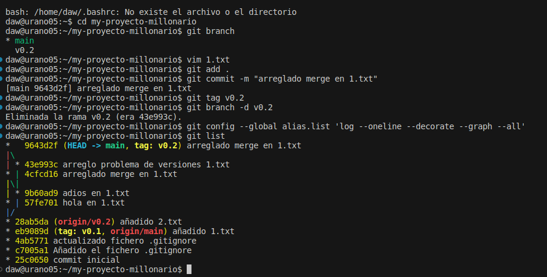

# CONTINUA LA MANIPULACIÓN AVANZADA DE GIT  

## ***Descripción:*** *(las respuestas a las preguntas de la tarea están dentro de las explicaciones)*
1. En primer lugar, creamos un Readme.md en nuestro nuevo repositorio (tras haberlo clonado), para que en caso de modificarlo sirva como presentación de nuestro proyecto. Tras ello, añadimos los cambios que hemos hecho (en este caso, añadir el Readme.md) y le hacemos un commit informando de ello. Acabado lo anterior, haremos un push para subir los cambios a la nube. En el documento de la tarea, nos indica que hagamos un push a origin master (que en nuestro repo sería la main), pero al haber clonado el repositorio podemos omitir parte de ese código y solo hacer git push.   

2. Ahora comenzamos a crear ficheros en el repo pero vamos a ignorarlo para que git no los tenga en cuenta. Para ello usaremos el comando touch y mkdir (creando así el fichero y la carpeta), y luego usaremos el comando echo que añadirá a donde queramos esos archivos. En este caso, al haber añadidio el archivo a .gitignore, a la hora de subirlo, los archivos serán "omitidos" y no se añadirán.   

3. Ahora, vamos a añadir un nuevo fichero llamado 1.txt, y haremos el git add y commit respectivos. Estos, lo que van a hacer es confirmar los cambios que hayamos realizado desde la última versión commiteada y, el posterior commit que es un mensaje que informa sobre lo que hayamos hecho. Por esa razón, es recomendable hacer commits de poco en poco trabajo para poder ir explicando todo paso por paso y detalladamente, que siempre será mejor que añadir un mensaje enorme sobre muchos cambios.   

4. Ahora, subiremos esos cambios haciendo un tag. EL tagf que ponemos sirve para indicar que una rama se mantiene inalterable. Puede interpretarse como un nombre para marcar un punto específico en el repo. Ahora, pasaremos a crear una rama v0.2, nos colocaremos en ella y en esa crearemos el fichero 2.txt. Normalmente la rama se utiliza para trabajar en algo de forma personal para luego, una vez comprobado que todo funciona fusionarlo con la rama principal y meter ahí esos cambios. En este momento, subiremos a la nube esa rama con sus cambios. Cuando ya esté salvada en la nube, haremos un merge de esa rama en la main para llevar esos cambios a la rama principal del repo.  
En la siguiente tarea, haremos algo similar pero forzando un conflicto para solucionarlo. Para ello, modificaremos el mismo fichero en la main y en una rama de forma diferente y luego haremos un merge, el que corregiremos con el vim 1.txt.   

5. Por último, para finalizar la tarea eliminaremos las rama v0.2 (tras hacerle un tag), y por último vamos a listas los commits, las ramas y sus tags y haremos un git list para que lo muestre.   
