# INSTALACIÓN DE MAVEN Y JAVA EN LA MÁQUINA VIRTUAL

## **Instalación de Java:** 
<div align="center">
1. En primer lugar, actualizamos el sistema (en este caso nuestra máquina virtual ubuntu 20.04) con el comando sudo apt-get update  

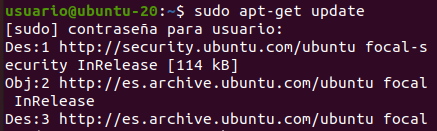

2. Una vez actualizada la máquina virtual, procedemos a ejecutar el comando ```sudo apt-get install default-jdk```, con el que instalaremos la version por defecto de java, que será la última disponible.  
 

3. Con java instalado, ejecutamos el comando ```java --version```, comprobando con ello que está java instalado y viendo también la versión que se ha instalado.  
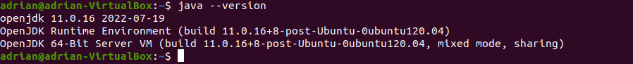  

4. Ahora, vamos a instalar versiones concretas de java, para que dado el caso que necesitemos instalar una version concreta por lo que fuera, sepamos hacerlo. Para ello ejecutaremos los comandos ```sudo apt install openjdk-11-jdk``` (en el número indicaremos la versión que requiramos).  
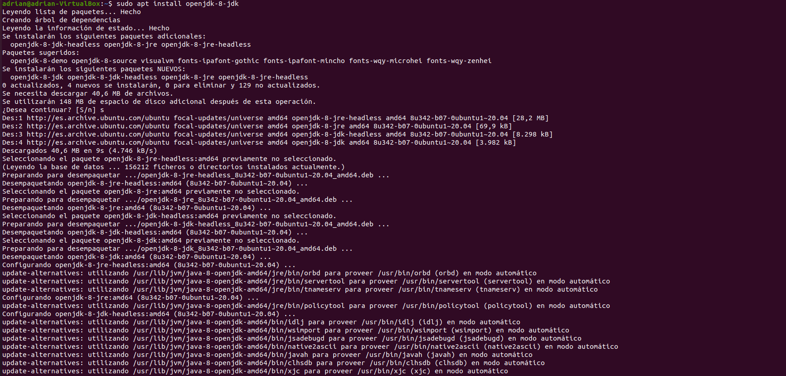  
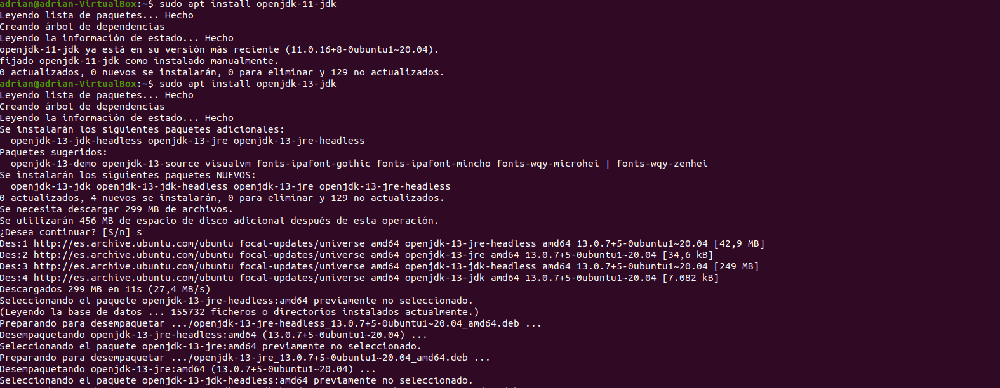

5. Con las versiones instaladas, ejecutamos de nuevo el comando ```java --version``` para comprobar si tenemos la versión que queremos instalada, en este caso queremos la 8. Como no tenemos seleccionada la versión, vamos a configurar las variables del entorno  
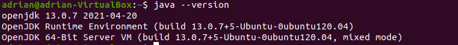  

6. Ahora, y para configurar las variables del entorno ejecutaremos el comadno ```ls/usr/lib/jvm``` comprobando así que se han descargado las versiones de OpenJDK que ejecutamos antes (versiones 11, 13 y 8). Una vez hecho, ejecutaremos ```sudo update-alternatives --config java``` y en la lista que se nos muestra, seleccionaremos el número de la versión que queremos. En este caso, el nº 3 que es el que señala la versión 8 de OpenJDK.  
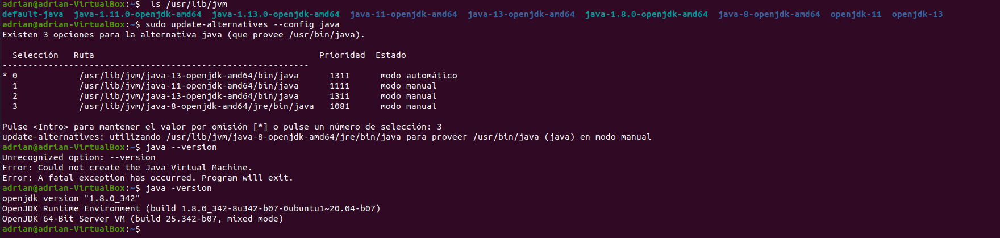  

## **Instalación de Maven:**
1. Para comenzar la instalación de Maven, ejecutamos el comando ``` sudo apt install maven```. (Nos saltamos el paso de actualizar la máquina virtual que ya lo hemos hecho en la instalación de Java)  
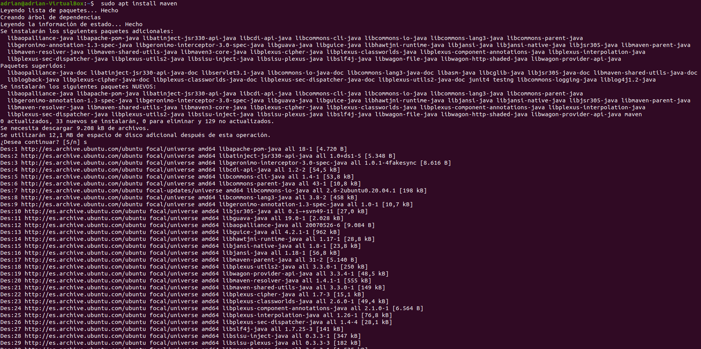  

2. Una vez instalado, repetimos como en java y comprobamos la versión que se ha instalado con ```mvn -version```  
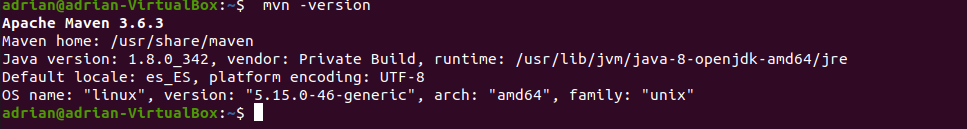  

3. Ahora, y con una version de maven instalada, vamos a seleccionar una versión concreta. De esta forma, vamos a instalar la versión 3.8.6 ejecutando el comando ```wget https://www.apache.org/dist/maven/maven-3/3.8.6/binaries/apache-maven-3.8.6-bin.tar.gz -P /tmp```. Como vemos, la elegida es la versión 3.8.6.  
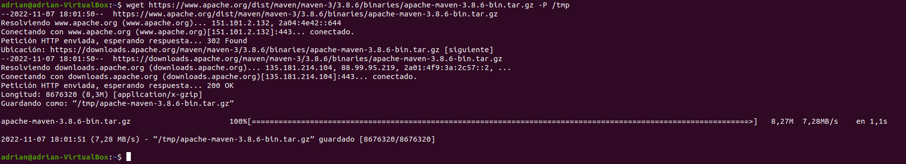  

4. Con la versión 3.8.6, vamos a ejecutar los comandos ```sudo tar xf /tmp/apache-maven-*.tar.gz -C /opt```y  ```sudo ln -s /opt/apache-maven-3.8.6 /opt/maven``` para extraer el archivo del directorio /opt y vamos a crear un enlace simbólico que vaya al directorio de Maven  
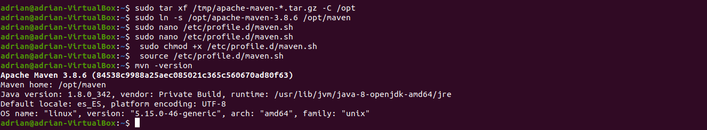  

5. Y dentro del directorio ponemos el código 
```export M2_HOME=/opt/maven|| export MAVEN_HOME=/opt/maven|| export PATH=${M2_HOME}/bin:${PATH}```. Posteriormente y con Ctrl + x, guardaremos y saldremos del archivo.  
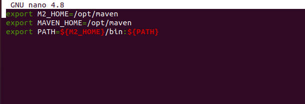  

6. Por último, ejecutamos los comandos ```sudo chmod +x /etc/profile.d/maven.sh``` y  ```source /etc/profile.d/maven.sh``` para hacer el script ejecutable con chmod y además, cargaremos las variabels de entorno usando el comando source. Una vez acabado, haremos un ```mvn -version``` para comprobar que estamos en la versión deseada (la antes descargada 3.8.6).
