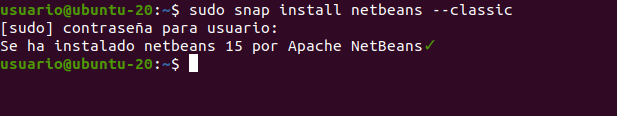
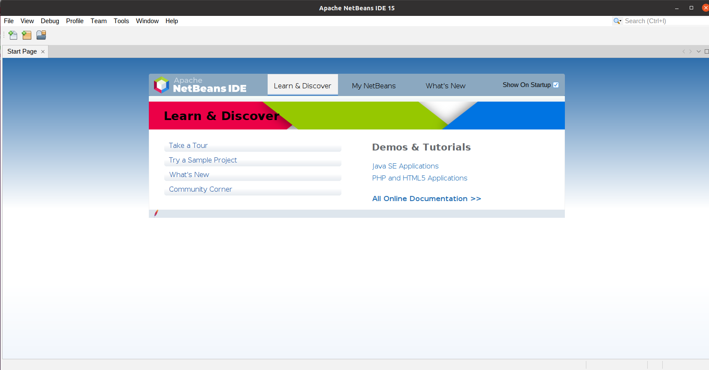
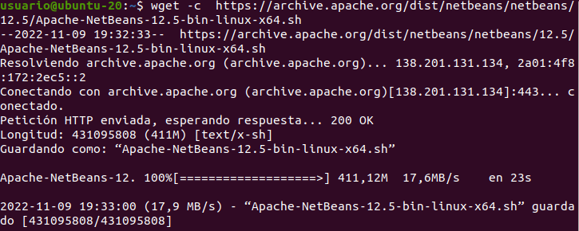
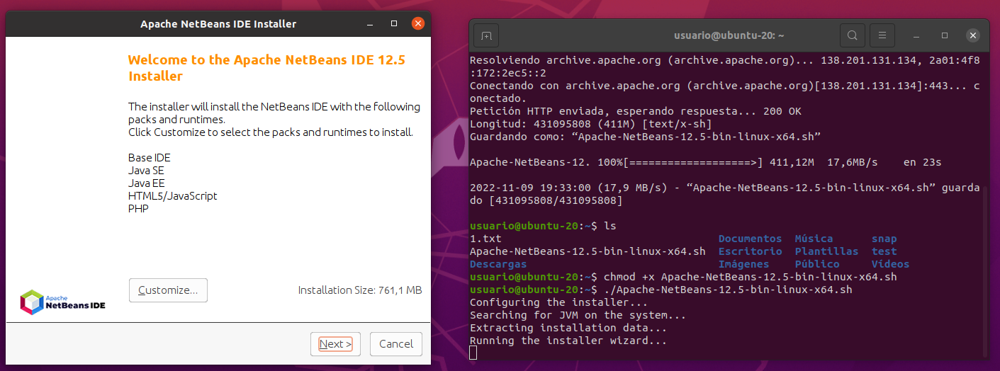
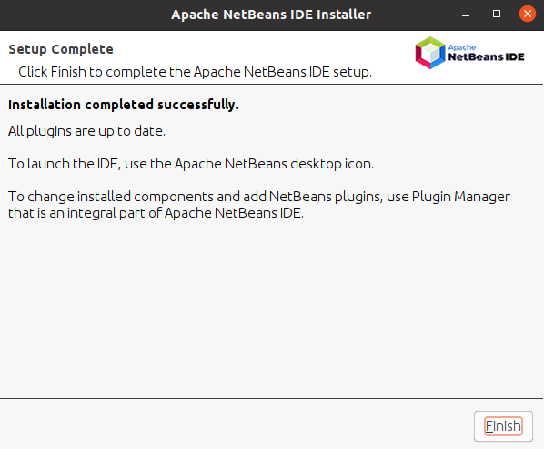

# INSTALACIÓN DEL IDE NETBEANS 12  

- Uno de los requisitos para instalar NeatBeans es tener instalado Java. Este requisito ya lo cumplimos y fue hecho en anteriores tareas.  

## ***Introducción:***  
- NetBeans IDE es un entorno de desarrollo integrado de código abierto y gratuito para el desarrollo de aplicaciones en los sistemas operativos Windows, Mac, Linux y Solaris. El IDE simplifica el desarrollo de aplicaciones web, empresariales, de escritorio y móviles que utilizan las plataformas Java y HTML5.

## ***Pasos e instalación:***  
1. En primer lugar vamos a instalar los paquetes snaps. Se pueden instalar en cualquier distribución Linux. Para ello usamos el comando ```sudo snap install netbeans --classic```. Y veremos el mensaje ```netbeans 12.5 from Apache NetBeans✓ installed```.  
  

2. Una vez instalado, pasamos a ejecutar el programa para ver que todo ha funcionado correctamente. Para ello previamente, abrimos las actividades en la máquina virtual y ejecutamos el programa    

3. Como vemos en la primera captura, la versión que se ha instalado no es la 12.5 como se indica en la tarea. Por esa razón, vamos a usar el comando ```wget -c  https://archive.apache.org/dist/netbeans/netbeans/12.5/Apache-NetBeans-12.5-bin-linux-x64.sh``` para obtenerla  
  

4. Luego, ejecutamos los comandos ```chmod +x Apache-NetBeans-12.5-bin-linux-x64.sh``` ```./Apache-NetBeans-12.5-bin-linux-x64.sh``` para hacer ejecutable el script del instalador y se instale.  
  

5. Y por último, comprobamos que todo está instalado. En este caso, daríamos a finish y tendríamos listo el programa.
  