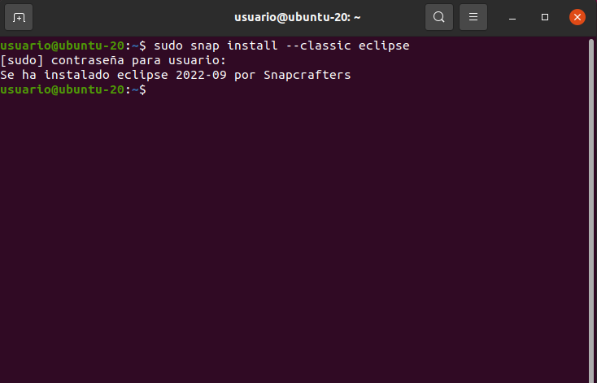
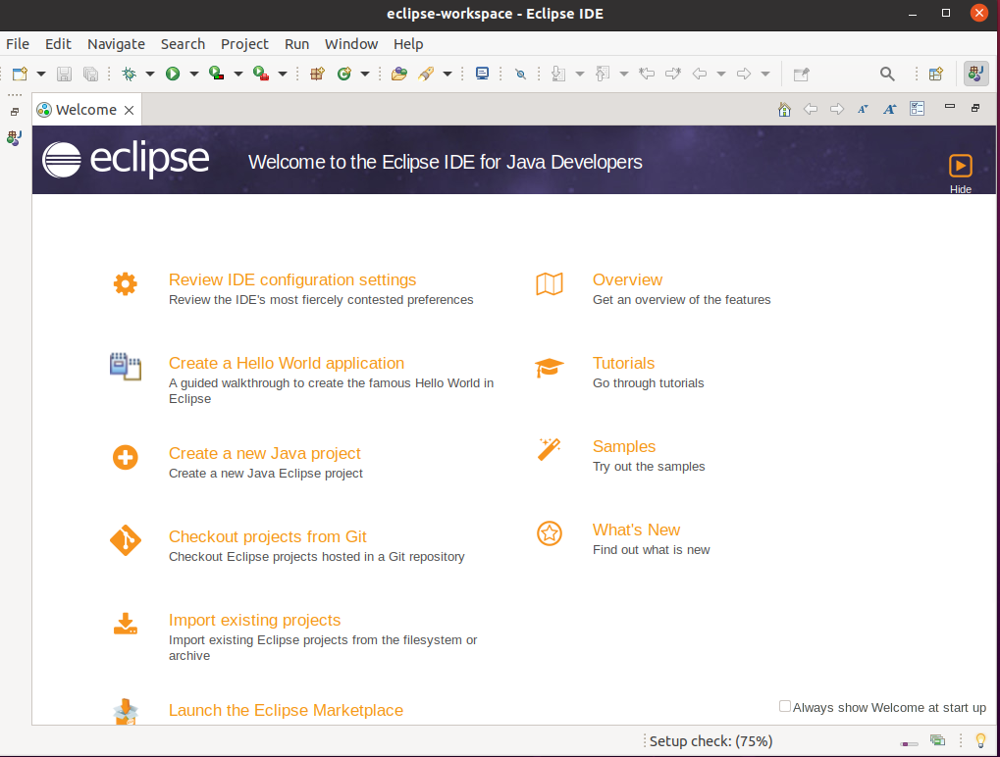

# INSTALACIÓN DE ECLIPSE
- De nuevo, uno de los requisitos es tener instalado Java, el cual cumplimos.  

## ***Introducción:***
Eclipse es una plataforma de software compuesto por un conjunto de herramientas de programación de código abierto multiplataforma para desarrollar lo que el proyecto llama "Aplicaciones de Cliente Enriquecido", opuesto a las aplicaciones "Cliente-liviano" basadas en navegadores.
## ***Pasos e instalación:***  

1. En primer lugar, ejecutamos el comando que nos permite la instalación de eclipse. Este es ```sudo snap install --classic eclipse```. Y con ello, se comenzará a instalar.  
  

2. Y una vez terminado, ejecutamos la aplicación para comprobar que haya sido correcta su instalación.  
  

- Como vemos, la instalación ha sido sencilla, pues solo nos ha tomado dos comandos tener listo el programa. A pesar de ello, debemos tener en cuenta cumplir los anteriores requisitos como tener actualizada la máquina, tener instalado Java y la respectiva versión que usemos (en caso de que no suemos la versión por defecto, que será la última). 