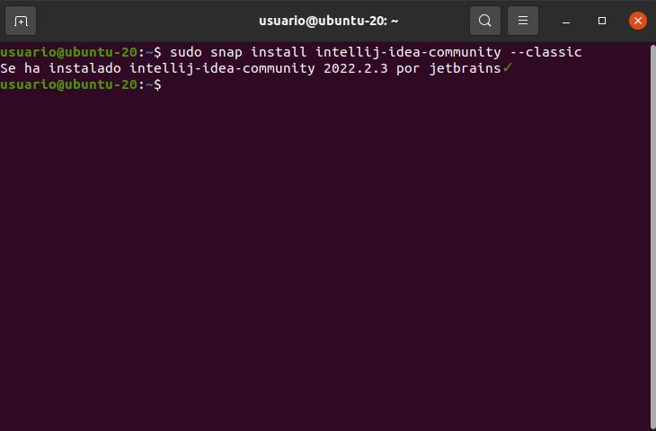

# INSTALACIÓN DE INTELLIJ IDEA
- Como en las anteriores, como requisito para empezar con esta instalación debemos tener Java instalado.   

## ***Introducción:***
IntelliJ IDEA es un entorno de desarrollo integrado para el desarrollo de programas informáticos. Es desarrollado por JetBrains, y está disponible en dos ediciones: edición para la comunidad​ y edición comercial

# ***Pasos e instalación:***  

1. Ejecutamos el comando ```sudo snap install intellij-idea-community --classic``` para instalar los paquetes Snap.  
  

2. Y una vez hecho, comprobamos que haya sido correctamente instalada ejecutando la aplicación.  
  

- AL igual que en el anterior, la instalación es sencilla. Con solo 1 comando ya podemos lanzar la aplicación. En las tareas, la dificultad y la mayor parte la ocupa la instalación de Maven y Java (con sus comandos concretos como la instalación de versiones que escojamos). 

