# INSTALACIÓN E INTRODUCCIÓN A MÓDULOS DE ODOO

- En este informe vamos a realizar la instalación de odoo, un sistema integrado de gestión empresarila que ofrece una serie de módulos que nos van a permitir adaptar el sistema que creemos a las necesidades de la empresa. Además de la instalación, veremos como se utilizan los módulos que la aplicación nos ofrece y crearemos un módulo propio. _La instalación será realizada desde windows_.

## INSTALACION DE ODOO PARTE 1:

- Antes de comenzar, para los pasos posteriores vendría bien tener algún IDE para modificar uno de los archivos de configuración, que aunque no es estrictamente necesario será de ayuda. En nuestro ejemplo, vamos a utilizar Sublime Text.

1. ### Descarga

   El primer paso es ir a la página web de <a href="https://www.odoo.com/es_ES">Odoo</a> en la que nos descargaremos el software. Al estar en windows, la instalación será sencilla ya que solo tendremos que descargar y lanzar el ejecutable, en el que una interfaz nos irá indicando los pasos a seguir.
   

      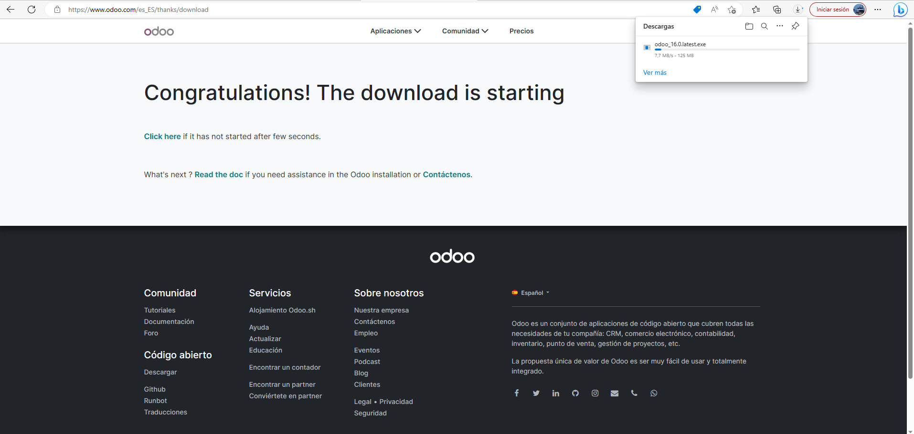
   

2. ### Instalación
   Una vez lanzado el ejecutable o instalador, iremos avanzando en las ventanas e iremos rellenando los datos. Como vemos en las siguientes imágenes, algunos de los datos que tendremos que rellenar es la ubicación en la que vamos a descargar. En nuestra prueba seleccionaremos el escritorio. En las siguientes ventanas, seleccionaremos Odoo server y la base de datos de PostgreSQL. También debemos poner una serie de datos que se nos solicitan para la creación de un usuario (lo cual haremos después de nuevo con la base de datos) Finalmente, aceptaremos las condiciones y términos y finalizaremos la instalación.
   

      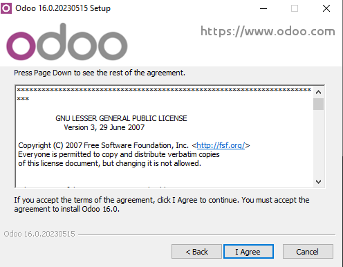
      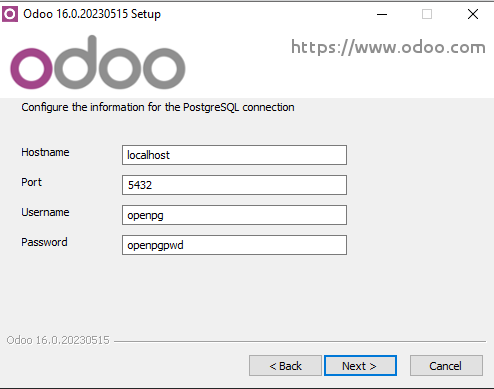
      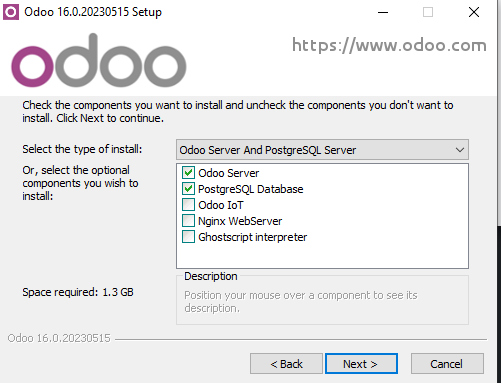
      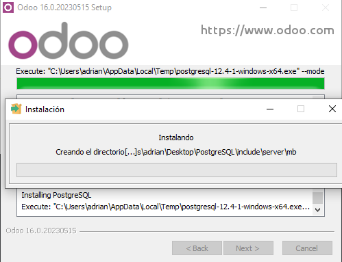
   

3. ## Datos y configuración

Con Odoo instalado, lo ejecutaremos para comenzar a introducir los datos del usuario y la configuración de la base de datos. Como vemos, nos va a preguntar una master password. Además, tendremos que rellenar otra información de registro típica como lo es el nombre de la base de datos, un email y una contraseña (diferente a la master password) junto al número de teléfono e idioma y país. Si leemos el mensaje generado por Odoo, nos viene creada una contraseña de serie para asegurar la base de datos.

   

      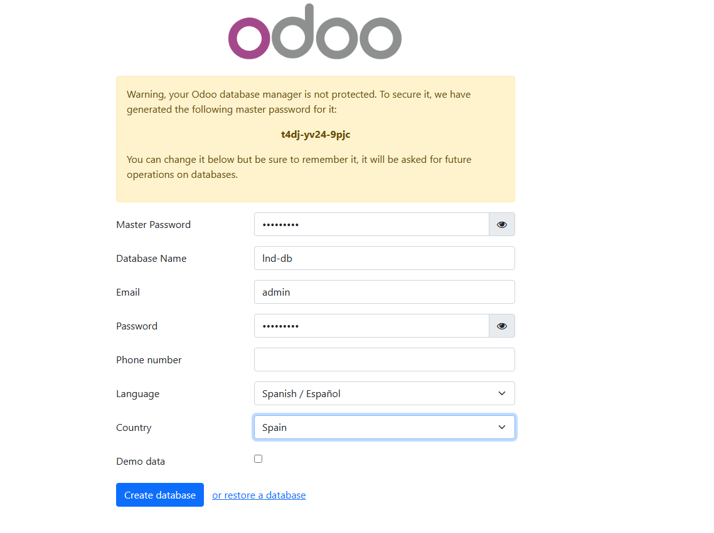
   

4. ### Dentro de Odoo

Una vez dentro, tendremos que iniciar sesión, usaremos el email y la contraseña asociada a ese email (no la master). Ya dentro de la aplicación tenemos en la parte de aplicaciones una gran selección de módulos que podremos usar y modificar. Para la continuación del informe, vamos a escoger el módulo de tienda online y comenzaremos a trabajar en él. Como veremos en las imágenes, primero tenemos una página de inicio de sesión normal y corriente y luego pasaremos a la parte de las aplicaciones. En esa parte, veremos la gran diversidad de elementos que Odoo nos brinda para poder comenzar con el software.

   

      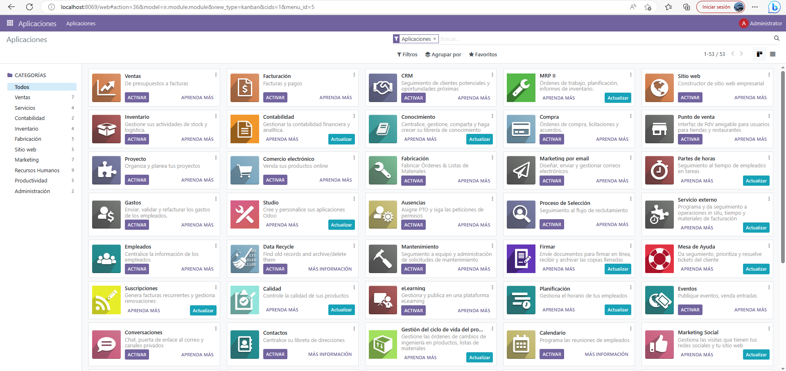
   

5. ### Generación y modificación de un módulo
   Tendremos que esperar un poco para que se genere nuestro módulo, pero una vez terminado este proceso podremos comenzar a modificarlo a nuestro gusto. Odoo nos da mucha opciones de personalización. Incluso antes de generar el modulo, podemos escoger una paleta de colores a seguir y, luego, podremos escoger entre 3 opciones distintas. Dentro ya de la edición, Odoo tiene predefinidas muchas herramientas que pueden ser de mucha utilidad. Tenemos "pre-construidas" barras de navegación, formatos de presentación, desplegables, botones y una larga serie de elementos relacionados con el módulo seleccionado (los mencionados son esos por haber seleccionado una tienda de ventas online). Además, podemos modificar de nuevo colores o añadir elementos que Odoo deja preparados. Por ejemplo con el logo, dentro del modulo tenemos varias ubicaciones con un espacio reservado para el logo de la tienda de la que estamos trabajando. Para empezar, vamos a modificar la parte principal o de presentación de la página. Cambiaremos imágen de fondo, nombres de los botones y desplegables y añadiremos un título y logo:
   

   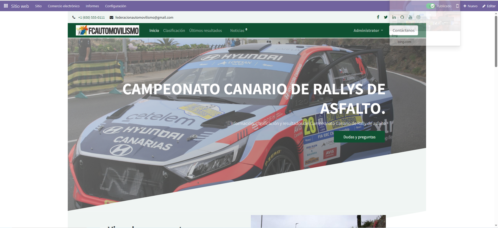
   

Continuamos bajando en la web y seguiremos añadiendo imágenes y algunas de las herramientas que por defecto nos ofrece Odoo. Hay formatos interesantes como imágenes interactivas al desplazamiento del navegador.

   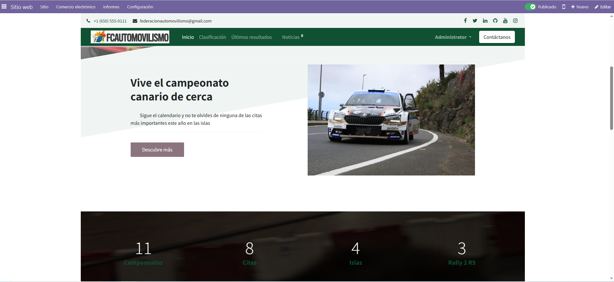

Ahora, vamos a modificar una parte interesante que son la parte de compras. En ella tenemos una especie de cartas con la información de lo que se vende y unos botones al final de las cartas que nos añaden lo que hayamos seleccionado al carrito. Los modificaremos adpatando la información a nuestras necesidades. Todos los diseños y colocación de los elementos en la página estaban colocados con la generación automática y ahora solo lo estamos editando.

   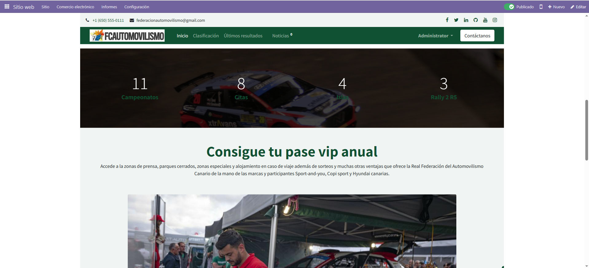

Por último respecto a este modulo, vamos a modificar el apartado de contacto utilizando la distribución generada automaticamente. Otra de las cosas positvias, es que los botones de contacto y similares están tambien automaticamente enlazados y nos llevan al apartado directamente.

   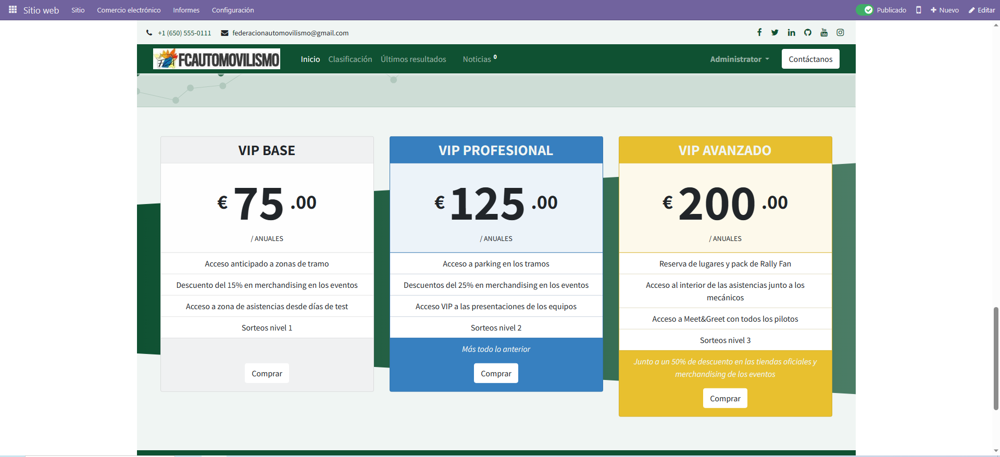

6. ### Detenemos servicios
   Una vez editado uno de los módulos que nos ofrece Odoo, vamos a crear nuestros propios módulos. Para empezar con este paso, debemos detener los servicios de odoo-server y el servicio de la base de datos PostgreSQL-for-Odoo. Para ello, como nos encontramos en Windows, simplemente iremos al administrador de tareas y daremos click derecho en los dos servicios y los detendremos.
      

         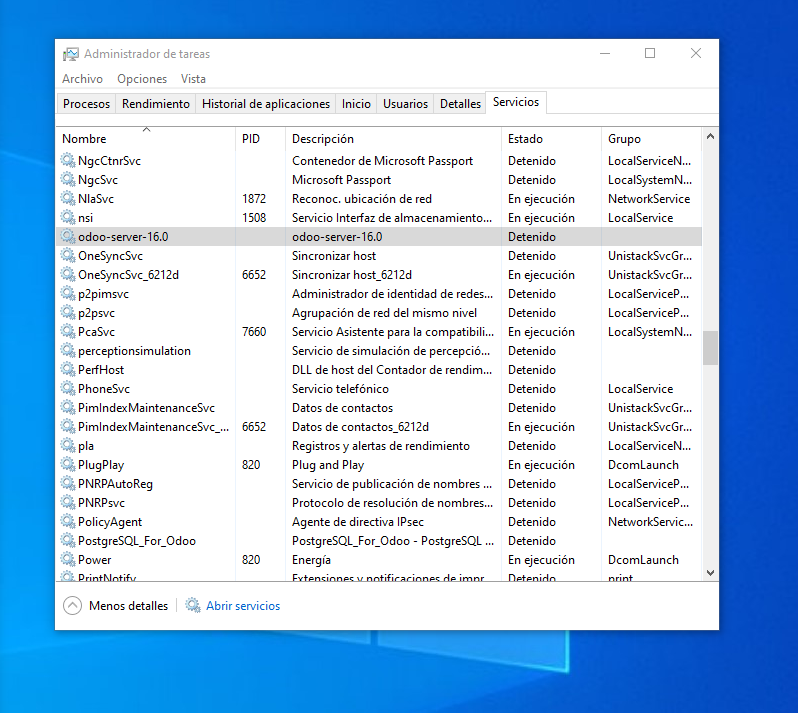
      

Con los servicios parados, vamos a crear una subcarpeta en la carpeta de server de la instalación de Odoo con el nombre de custom_addons, que va a ser la localización de todos los nuevos módulos que queramos crear.

   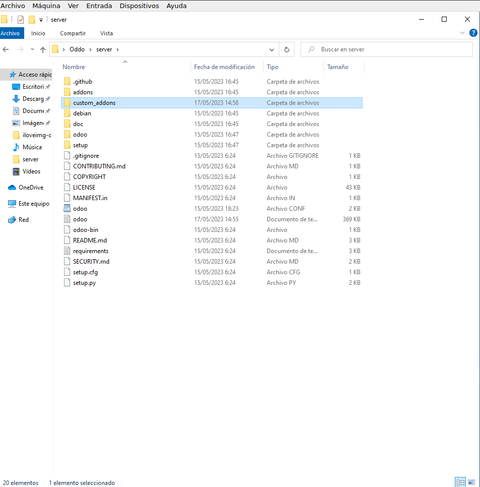

Ahora, viene la parte en la que vamos a utilizar el IDE que mencionabamos en la introducción. Vale cualquiera, e incluso si quisieramos podriamos usar las notas. Con nuestro ejemplo, vamos a abrir el fichero de configuración de Odoo (dentro de la carpeta server) y vamos a modificar el primer parámetro añadiendo la ruta de la nueva carpeta que hemos creado. Lo pondremos en addons_path junto a la ruta por defecto especificada, separadas por una coma y sin espacios

   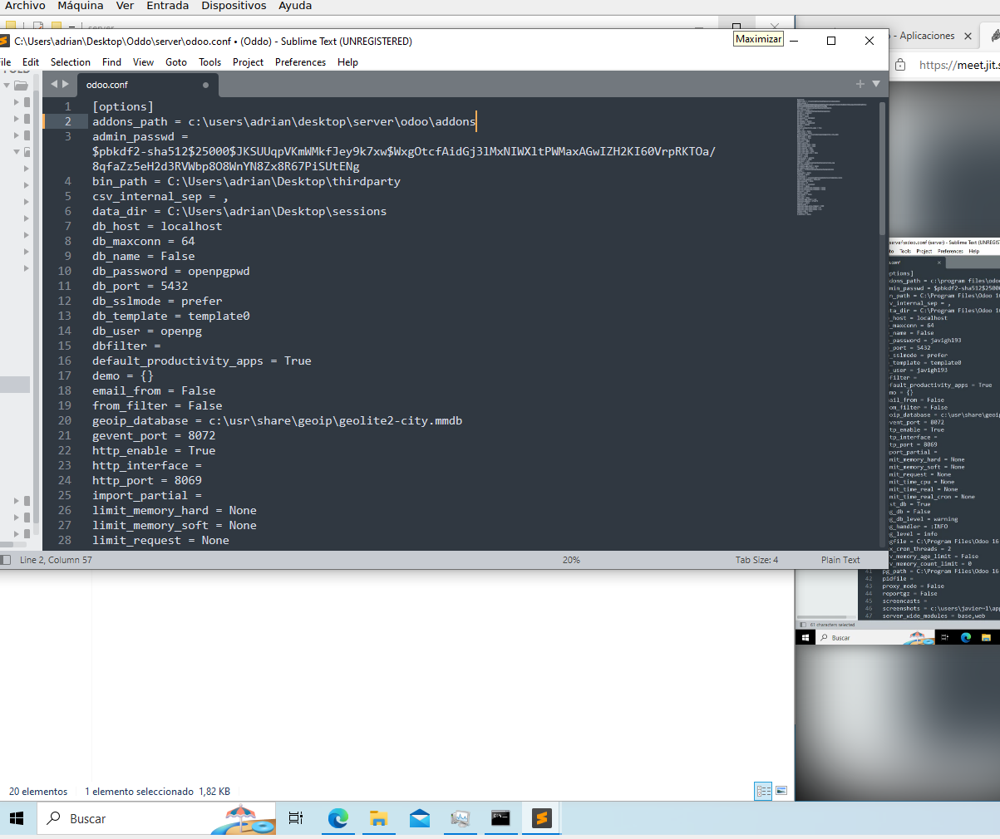

  
7. ### Re-lanzamos servicios y actualizamos la interfaz gráfica  
Ahora, desde la cmd vamos a lanzar de nuevo los servicios para que se inicien y se recargue la nueva información que hemos añadido. Si todo funciona correctamente (en mi caso, no ha sido así), deberiamos poder entrar de nuevo a la interfaz gráfica y actualizando deberíamos ver nuestro nuevo módulo.  

   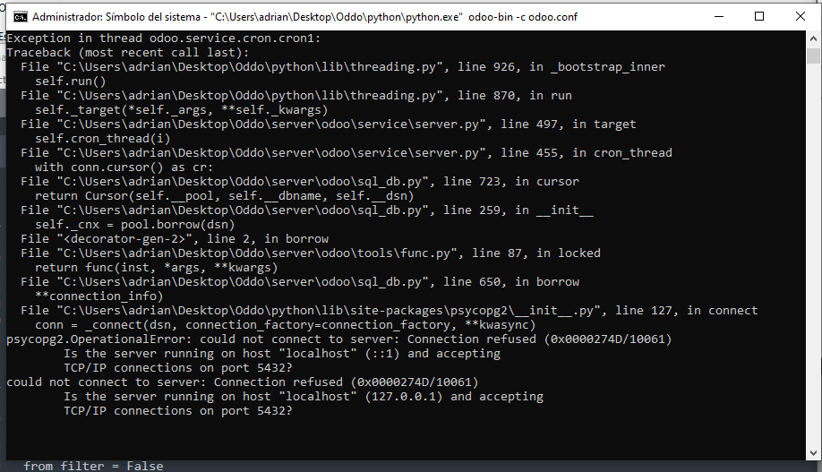

## PREGUNTAS TEÓRICAS PARTE 2:

1. ¿Cuáles son las principales características y funcionalidades del ERP de Odoo?:

   - Odoo es un software ERP y CRM que se encarga de ofrecer un conjunto de aplicaciones de código abierto que cubren todas las necesidades de una compañía con gestiones de comercios electrónicos, contabilidad, inventario y muchos otros módulos dedicados a la gestión empresarial. Además integra un sitio web y tienda online que podemos personalizar a nuestro gusto para adpartarlo así a las necesidades de nuestros clientes. Es una buena opción para la gestión de unas cuantas aplicaciones, pero en caso de ser una empresa de gran tamaño con muchos proyectos detrás quizá deberíamos buscar otro tipo de software porque la gestión de demasiados proyectos conllevaría a tener que pagar uno de los planes de Odoo.

2. ¿Cómo puede el ERP de Odoo ayudar a las empresas a mejorar su eficiencia operativa?:
   - A través de las diferentes herramientas de este software, las empresas pueden automatizar y mejorar la eficiencia de su gestión. Diferentes características como poder ver en tiempo real tidas las operaciones conlleva a una toma de decisiones más rápidas, es mucho más eficiente el hecho de acabar con tediosas tareas manuales que se pueden automatizar, una reducción de costes y muchas otras más.
3. ¿Qué módulos y aplicaciones adicionales ofrece Odoo para complementar su funcionalidad de ERP?:
   - Odoo cuenta con una serie grande de módulos, pero las más utilizadas o más importantes son: Módulo de compras con el que una empresa puede de forma sencilla realizar muchas acciones como lanzar ofertas de compra o un sistema de propuestas, Módulo de ventas para gestionar todas las ventas de una empresa con una interfaz amigable y con una gran posibilidad de integración con otros módulos como el CRM, Módulo de contabilidad con un diseño sencillo y optimizado para ver los datos de forma visual y pensado para integrarse incluso en grandes estrucuras como puede ser un banco...
4. ¿Cuáles son las ventajas de utilizar el ERP de Odoo en comparación con otros sistemas similares en el mercado?
   - Algunas de las ventajas que nos ofrece Odoo respecto a otros sistemas son:
     - Integración: Una amplia variedad de aplicaciones que se pueden integrar y que van a facilitar el trabajo
     - Interfaz: La interfaz de Odoo es realmente sencilla de usar y muy intuitiva para la gente que esté comenzando. Es una gran ventaja que permite a los nuevos no atascarse y permite potenciar la eficiencia de los usuarios avanzados.
     - Variedad empresarial: Odoo es un software que pueden usar desde empresas pequeñas con pocos trabajadores o start ups que esten comenzando y también es una buena opción para empresas de mayor tamaño, todo ello gracias a la arquitectura diseñada para permitir un sistema que vaya, poco a poco, creciendo.
5. ¿Cuáles son los requisitos técnicos para implementar el ERP de Odoo en una empresa y qué consideraciones se deben tener en cuenta antes de iniciar la implementación?
   - En primer lugar es importante valorar el sistema operativo a usar, incluso si van a ser diferentes en varias secciones de la empresa, puesto que la instalación no va a ser igual y se ha de tener en cuenta las posibles diferencias. También sería importante tener a alguna persona a cargo de la gestión de como se va a trabajar en Odoo para compatibilizar el trabajo en equipo y que varias personas puedan trabajar en lo mismo con la intención de dividir el trabajo y mejorar la eficiencia. Por último, sería interesante hacer una buena planificación antes de la instalación para que todos tengan en cuenta instalaciones de modulos o de la forma en que se van a personalizar los modulos que ya nos ofrece la aplicación.

## MODULOS DESDE MAQUINA VIRTUAL PARTE 3:

- En este caso vamos a jugar con los modulos de Odoo desde la máquina virtual. En primer lugar debemos descargar la maquina virtual para importarla, este paso nos va a ahorrar la tediosa parte de la instalación. Cuando hayamos descargado e importado la máquina virtual, solo tendremos que iniciarla y comenzar a seguir las indicaciones que esta nos indica. Cuando la iniciemos veremos:

   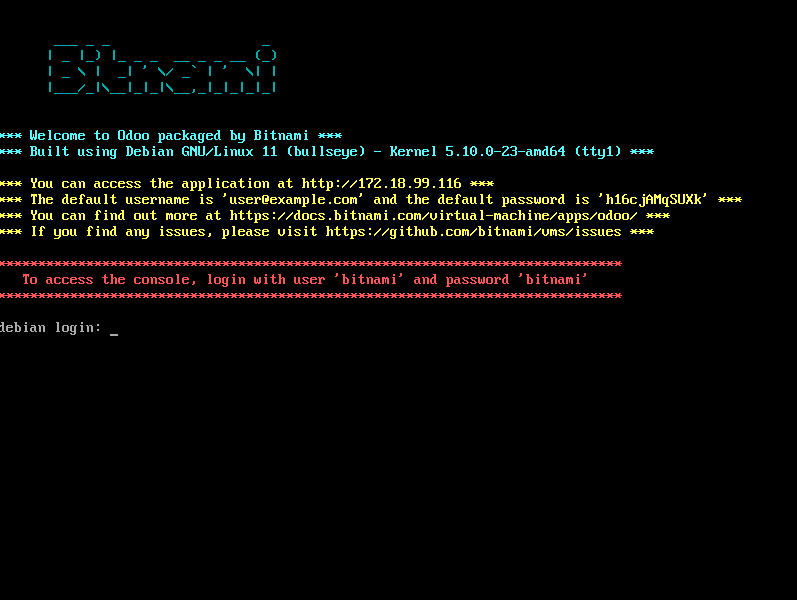

Como vemos, la consola nos indica que tatno usuario como contraseña son "bitnami". Cuando nos hayamos identificado con esas credenciales, la consola automaticamente nos exigirá cambiar la contraseña y colocaremos ahí la que queramos.

   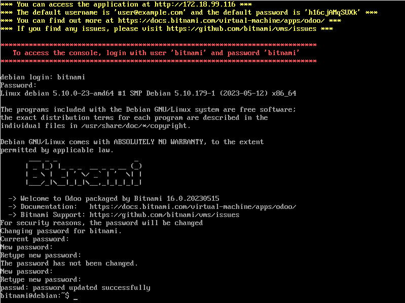

Con la contraseña ya cambiada, tendremos que irnos a una máquina virtual o a la máquina real y vamos a buscar en un navegador de nuestra preferencia el link que nos indica la consola de la maquina virtual. En este caso, usaremos el link https://172.18.99.116, el cual nos llevará directamente a Odoo, concretamente a la parte de login. Ya tenemos un usuario creado, que también es indicado en la consola. El email siempre será "user@example.com", y la contraseña variará en función de cada usuario. En nuestro caso, nos identificaremos con ese correo y con la contraseña "h16cjAMqSUXk". De esa forma ya podremos entrar dentro de Odoo.

   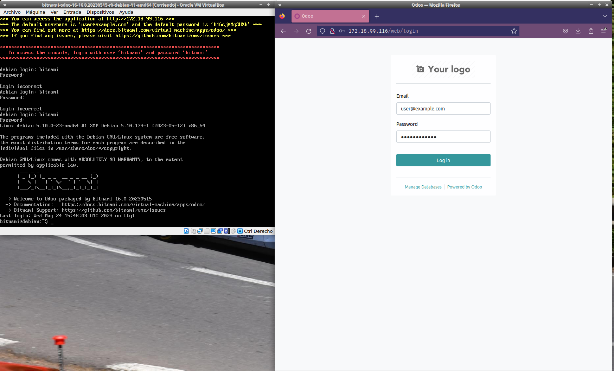

Dentro de Odoo, la interfaz es exactamente igual que en el apartado 1, donde podremos elegir en la parte de apps todos los módulos que se nos ofrecen. En este caso y para no repetir lo realziado en el apartado 1 vamos a utilizar el modulo de "Forum". De forma similar, al seleccionarlo se nos dará acceso al módulo y comenzará a generarse una plantilla por defecto que podremos modificar a nuestro gusto.

   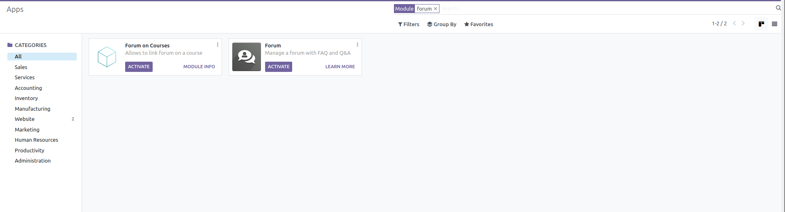

   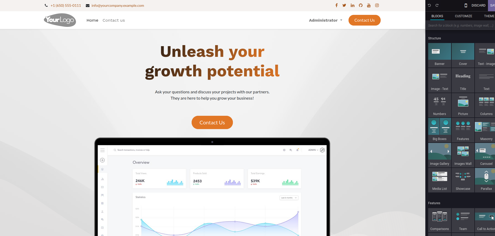

